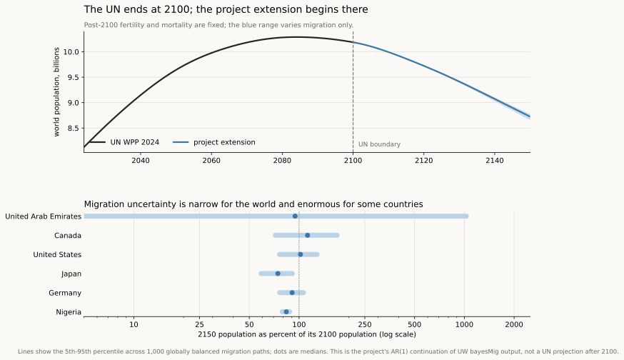
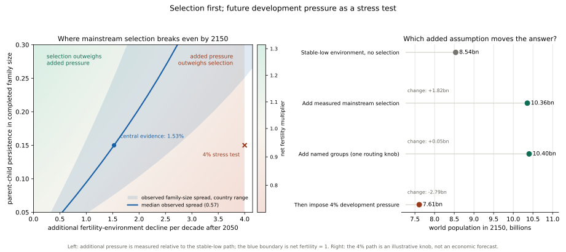

# World population model to 2150

A 237-country cohort-component projection to 2150, carrying a fertility
mechanism that a national average cannot represent, and a working paper that
reports what it costs to cancel it.

**Read the paper:**
[`paper/population-model-1_2_2.pdf`](paper/population-model-1_2_2.pdf), with
[`paper/population-model-supplement-1_2_2.pdf`](paper/population-model-supplement-1_2_2.pdf)
for the engine validation, parameter sources, historical backtest and the full
reproducibility path. **Read the argument** at
[population.dylanslagh.com](https://population.dylanslagh.com), built from
`site/` into `index.html`. **Explore the countries** in the interactive map at
`map/index.html`. **Read how it was made:** every conversation that produced
the project is committed in [`conversations/`](conversations/).

If you are picking the project up in a new session, start with
[HANDOFF.md](HANDOFF.md), which carries the current status and the traps; the
exact local paths for R, Python, Tectonic and the downloaded UW data are in
[LOCAL_TOOLS.md](LOCAL_TOOLS.md). The design brief is in
[spec/population-2150-spec-v0.3.md](spec/population-2150-spec-v0.3.md) and it is
the authority on why the project exists; this file is about what has actually
been built.

The short version of the argument: by 2150 essentially nobody alive today is
still alive, so the answer is dominated entirely by what long-run fertility
does. A long-run fertility of 1.85 versus 1.30 is a 4.4× difference in world
population at 2150, from a parameter nobody can measure. Precision in the base
data is nearly irrelevant. Precision about the mechanism is everything.

## How it works


Both sides use the same dependable accounting: age people one year, apply
survival, count births, and add migration. The disagreement is upstream. The
UN-style baseline supplies future fertility, survival, and migration paths.
This project's mechanism also asks how the fertility environment and the
changing mix of people generate the fertility path.

The mechanism tracks family-size variation and parent-child
persistence in the mainstream population, plus fertility, retention, and
convergence for named high-fertility groups. Its extra outputs show how
composition changes, how much selection lifts fertility, whether a rebound
occurs, and which assumptions make the answer uncertain.

## The three model objects

1. **UN reproduction, through 2100.** This is the engine validation and ends
   where WPP 2024 ends. Nothing after the boundary is labelled as an official
   UN result.
2. **UN project extension, 2100-2150.** This starts from the published 2100
   population. Final UN fertility and mortality schedules are held constant;
   migration continues through 1,000 globally balanced stochastic paths from
   an AR(1) emulator of UW's `bayesMig` output.
3. **Selection model, 2024-2150.** This is the project's main focus. It forks
   in 2024 so selection operates for the whole projection. The economic or
   environmental pressure parameter is used mainly to draw the break-even
   boundary, not as a preferred economic forecast.



The public migration archive omits its fitted MCMC state, so the continuation
is explicitly a model-output emulator rather than an official UN projection.
Every draw-year is balanced to zero world net migration. The full method is in
[`docs/migration-extension.md`](docs/migration-extension.md).

## Selection first, development pressure second



The benchmark is **selection only**: retain the
fertility decline already in the data and projected path, remove the assumed
recovery, add no further post-2050 environmental decline, and let measured
mainstream composition change. Future development pressure is then a stress-test
axis rather than a preferred forecast.

At the central measured family-size spread and parent-child persistence,
mainstream selection reaches a 1.164 fertility multiplier by 2150. An additional
decline of **1.52% per decade** after 2050 cancels it — that is the paper's
headline, solved across 50 paired stochastic migration paths, and the coarser
deterministic lattice puts the same cell at 1.53%. The 4% path is an
intentionally severe stress test, not an estimate of the future economy.

The model ladder is a reduction test. Mainstream selection, calculated from two
verified inputs through a fixed three-type approximation, adds 1.82 billion to
the stable-low/no-selection 2150 result. Named groups and one routing knob add
only another 0.05 billion; the 4% development-pressure knob then removes 2.79
billion. This is why the boundary, not the 4% scenario's population total, is
the primary mechanism result.

## The backtest: how wrong was the UN last time?

The spec's first priority, and the part it calls the actual contribution. The
UN has published fourteen revisions of its projections since 1992. Each one
made predictions about years that have since arrived, and each was quietly
superseded by the next. Nobody goes back and marks them.

All fourteen are downloadable. This grades the eight from 1992 to 2008 against
what the UN itself now estimates happened.


**The UN has been under-projecting world population, consistently, for thirty
years.** The 1992 revision ran too high. Every revision from 1996 onward has run
too low — by 2.5% on average, and the gap widens the further ahead it looks.

That direction is the finding. Being off by 2.5% is unremarkable for a
thirty-year forecast. Being off by 2.5% *in the same direction, revision after
revision* is a bias, which means something in the model is systematically wrong
rather than merely uncertain. Random error you can live with; a bias you can
diagnose.

Two fertility mistakes account for most of it, and the spec named both in
advance:


| What the spec predicted | What the backtest found |
|---|---|
| African fertility: decline assumed to follow the Asian path; it stalled | **9.8% too low**, every vintage |
| East Asian fertility: a floor assumed near replacement; it went to 0.7 | **14.9% too high**, every vintage |
| Life expectancy: under-projected for sixty years running | **1.3 years too low** on average |

The two fertility errors point in opposite directions and do not cancel,
because they land on populations of very different size and growth rate.

One more number worth sitting with: of 117 world-level projections across these
eight revisions, **41 landed inside the UN's own low-to-high band — 35%.** Those
variants are fertility scenarios rather than a probability interval, so this
isn't a calibration score. But it is a plain answer to "was reality inside the
range they were willing to print," and the answer is usually no.

Everything above is regenerated by `scripts/run_backtest.py` from the archives
themselves. The comparison is against WPP 2024's estimates, which are a model
output rather than ground truth — a caveat that matters for a single weak-data
country and very little for the world total.

## What exists now

**The projection engine, built and tested.** This is phase 2 of the six phases
in the spec. It is the piece everything else hangs off: given fertility,
mortality and migration, it moves people through the years one at a time. It
contains no theory about the future — that is deliberate, so that later results
can be attributed to a mechanism rather than to arithmetic.

It is checked against the UN's own published projections, using only published
inputs and nothing fitted:

| Check | Result |
|---|---|
| World population at 2100, UN zero-migration variant | **0.001%** apart |
| Any country over 10,000 people, at 2100 | worst **0.13%** (Cook Islands) |
| Any five-year age group under 100, at 2100 | worst **0.006%** |
| Constant fertility at 2100, against the UN's own version | **0.05%** apart |

Reproducing the UN is not the goal — the spec is explicit that the UN will win
at 2050 and that's fine. It is the proof that the machinery is sound before any
of the project's own claims get loaded into it.

**What the deterministic diagnostic says:** world population peaks at
**10.29 billion in 2084**, and reaches **8.78 billion by 2150**. Only the portion
through 2100 is the UN reproduction; past it the run simply holds fertility,
mortality and the final migration counts, which makes it a comparison rather
than the project's reference extension. The stochastic migration extension is
the reference, and reaches a median **8.725 billion** in 2150 with a
migration-only 90% range of **8.656-8.772 billion**.

The absurdity check — every woman keeps having children at exactly the 2024 rate
for her age and country, forever — gives **53 billion in 2150**. Nobody believes
it. It is there because a projection engine that cannot produce an absurd number
from an absurd assumption is broken.

All numbers above come from `out/validation_wpp2024.json` and
`out/run_to_2150.json`, regenerated by the scripts below. Nothing here is typed
in by hand.

**The Phase 4 probabilistic baseline, complete.** The University of Washington's
annual fertility and life-expectancy archives are downloaded, checked against
the publisher's byte lengths, fingerprinted with SHA-256, and read through a
version-pinned R environment using UW's own accessors. These are UW products
aligned to WPP 2024, not official UN products, and the code says so wherever
the result is shown.

The probabilistic path keeps two deliberate boundaries. The first preserves the
1,000 total-fertility and female/male life-expectancy trajectories with their
original draw identities; a separately versioned step turns those compact
trajectories into the age-specific rates the engine needs. The second advances
each draw through the already-tested engine, one at a time. Fertility and
mortality draw IDs, their pairing rule, migration assumptions, and any decision
to hold a rate past its final source year stay attached to the result.

The ensemble is stored as vintage `2026-08-10-phase4-uw-baseline` with every
quantity marked `is_project_claim: false`. It is a **conventional probabilistic
comparator**, not this project's own view of 2150: it propagates UW's
mean-reverting posterior, which is the assumption the spec's eighth standing
instruction declines to adopt by default. Phase 5 needed something fixed to be
compared against, and this is it.

**The Phase 5 mechanistic layer, complete.** Selection is an extra composition
axis on the same engine. Setting every fertility propensity to one reproduces
the ordinary engine to a relative difference of 3×10⁻¹⁶, so any difference in a
result is the mechanism rather than a second implementation of the arithmetic.
All eight sourced mechanism parameters are checked against their sources in
[`docs/mechanism-parameter-audit.md`](docs/mechanism-parameter-audit.md); five
further parameters are scenario knobs with no independently established future
value, are labelled as such in the loader, and none of them carries a headline.

## Two conventions that look like rounding and are not

**Childbearing runs 10–54, not 15–49.** The UN's single-age fertility file
covers 15–49; its five-year file covers 10–54. The mothers outside the narrower
window are about 0.3% of world births, which is 0.3% at 2100 and still growing
— small enough to read as rounding, and a compounding bias over 126 years. The
ingest assembles both files and refuses to build if the result does not
reproduce the UN's published fertility rate.

**Constant fertility means "freeze the base year", so it is not a fixed
number.** Any published constant-fertility total is a function of the base
year's fertility, and world fertility has fallen a long way between revisions.
The check that bites is therefore reproducing the UN's *own* WPP 2024
constant-fertility variant, which the engine does to 0.05% — not matching a
total quoted from an older report against a newer base.

## Running it

Needs Python 3.11+ with numpy and pandas. Nothing else.

```bash
python scripts/fetch_wpp.py
```

Downloads about 1.1 GB of UN source data, once. It records a SHA-256 for every
file in `data/manifest/`, which *is* committed — so a fresh clone can prove it
got byte-identical data, and a file quietly reissued by the UN causes a loud
failure instead of a silent change in results months later.

```bash
python scripts/build_bundle.py       # source CSVs into compact arrays (~90s)
python scripts/validate_engine.py    # the engine test above
python scripts/run_un_extension.py   # project extension: stochastic migration
python scripts/plot_un_extension.py  # boundary and country-range figure
python scripts/run_to_2150.py        # older deterministic scenario diagnostics
python -m pytest tests/ -q           # fast tests, no data needed
```

The completed-family-size dispersion used by Phase 5 is independently
reproducible. CFE's original aggregate tabulations remain gitignored under its
research-use terms; the repository commits URLs, hashes, readers, derived
moments, and the audit chart. The CDC tables provide a separate U.S. check:

```bash
python scripts/fetch_cfe.py
python scripts/fetch_cdc_cohort.py
python scripts/analyze_cfe_dispersion.py
python scripts/analyze_mainstream_cv_sensitivity.py
```

The Phase 4 source inventory can be inspected without downloading anything.
The full annual UW archives total 2.24 GB compressed:

```bash
python scripts/fetch_uw_posteriors.py --list
python scripts/fetch_uw_posteriors.py
python scripts/fetch_uw_posteriors.py --check
python scripts/unpack_uw_posteriors.py
```

The native objects must be read with the pinned R environment. After installing
R 4.4.2 and Rtools44, set the two paths for that installation and run:

```powershell
$env:RTOOLS44_HOME = 'C:\path\to\rtools44'
$rscript = 'C:\path\to\R-4.4.2\bin\Rscript.exe'
& $rscript --vanilla r\uw-extract\bootstrap.R
python scripts\export_uw_fixture.py --rscript $rscript
```

The paper and the public site are built separately from the scientific data
pipeline:

```bash
python scripts/build_paper.py
python scripts/build_site_assets.py   # globe + story data, standard library only
python scripts/build_site.py          # assemble index.html; fails on a stale number
python scripts/build_public.py        # stage dist/ and check every local link
```

For the backtest, which needs the archived revisions and two extra libraries
(`xlrd` to read 1990s Excel, `matplotlib` to draw):

```bash
python scripts/fetch_archive.py      # ~590 MB of archived revisions, once
python scripts/run_backtest.py       # grade all eight vintages
python scripts/plot_backtest.py      # regenerate the figures above
```

## How the repo is laid out

```
spec/            the design brief, version 0.3
site/            sources for the public front page: template, body, app.js, data
index.html       the built public site. generated; do not edit by hand
map/index.html   the interactive country map, also generated
paper/           LaTeX manuscript, public landing page, and reviewed PDF
r/uw-extract/    pinned official-accessor reader for UW's native R objects
src/popmodel/
  sources/       which UN files, from where, and proof of what arrived
  ingest/        CSV to arrays (wpp.py = engine inputs, reference.py = check targets)
  engine/        the projection itself. no theory about the future lives here
  bayes/         strict draw contracts and one-draw-at-a-time propagation
  backtest.py    grading the UN's past revisions against what happened
  scenarios.py   named futures, each carrying a falsifiable implication and a date
  track/         stored predictions and the scoring rules
tests/           fast tests with answers worked out independently of the code
scripts/         the things you actually run
data/, out/      downloaded and generated; not committed, all regenerable
vintages/        stored predictions; committed, and never overwritten
```

## Licence and reuse

Two licences, because a repository like this contains two different kinds of
thing.

| | |
|---|---|
| **Code** — everything under `src/`, `scripts/`, `tests/`, `r/`, and the site sources in `site/` | [MIT](LICENSE) |
| **Writing, figures and derived tables** — the paper and supplement, `docs/`, the built pages, `data/reference/`, `vintages/` | [CC BY 4.0](LICENSE-CC-BY-4.0.txt) |

`CITATION.cff` carries the citation; GitHub renders it as a *Cite this
repository* button. Cite the paper rather than the repository.

### What is not ours to license

The CC BY 4.0 grant above extends only as far as this project's own work.
Everything the model is built from belongs to somebody else and arrives with
its own terms, which travel with any reuse:

| Source | Terms | What this repository does with it |
|---|---|---|
| [UN World Population Prospects 2024](https://population.un.org/wpp/) | CC BY 3.0 IGO | Not redistributed. Population figures derived from it appear in the built pages, attributed. |
| [EURREP Cohort Fertility and Education database](https://www.eurrep.org/database/database/) | [Research use; original tabulations may not be passed on](https://www.eurrep.org/database/about/terms-of-use/) | The tabulations stay downloaded-only and gitignored. Only derived statistics — means, variances, coefficients of variation — are committed. |
| [University of Washington bayesPop / bayesMig](https://bayespop.csss.washington.edu/) | [No licence or redistribution terms are published](https://bayespop.csss.washington.edu/download/); the download page states only a citation requirement, and that these are a University of Washington product and not an official UN product (checked 2026-08-19) | Not redistributed. Percentile bands derived from the published trajectories appear in the map page, attributed to Azose and Raftery. |
| [Natural Earth](https://www.naturalearthdata.com/) | Public domain | Simplified outlines are committed in `site/data/`. |
| [CDC/NCHS cohort fertility tables](https://www.cdc.gov/nchs/nvss/cohort_fertility_tables.htm) | US federal work, public domain | Used for the independent United States check. |

If you reuse the derived tables, the obligation to acknowledge the sources above
comes with them.

## What is next

Phases 1 to 5 are built and tested. What remains is phase 6, **scoring**: the
formats are fixed, two prediction vintages are stored, and the writer raises
rather than overwrite one. Nothing in it resolves soon. WPP 2027 is the next
data event that moves any of these predictions, and the cohort fertility that
would settle the mechanism's central parameter does not complete until about
2038. A model that keeps score has to wait for the score.

Smaller work that is genuinely open is listed in
[HANDOFF.md](HANDOFF.md#4-what-is-not-built).
