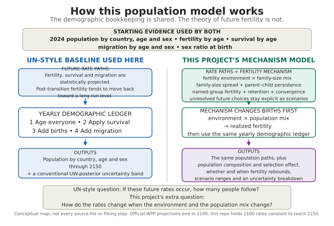
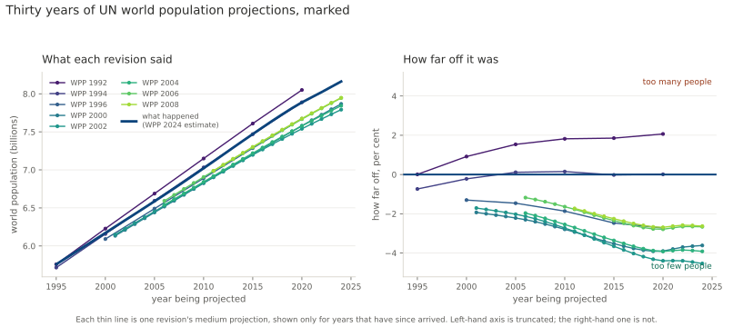
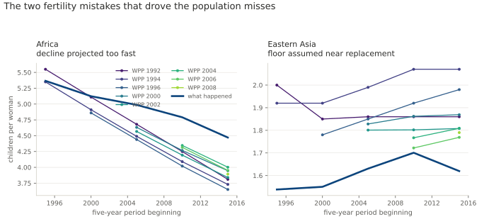

# World population model to 2150

An interactive map, backed by a demographic projection that runs to 2150 and
keeps score of its own predictions. The design brief is in
[spec/population-2150-spec-v0.3.md](spec/population-2150-spec-v0.3.md) and it is
the authority on why the project exists; this file is about what has actually
been built. If you are picking the project up to work on it, read
[HANDOFF.md](HANDOFF.md). The companion manuscript is available as both a
[paper landing page](paper/index.html) and a reviewed
[PDF](paper/population-model.pdf).

The short version of the argument: by 2150 essentially nobody alive today is
still alive, so the answer is dominated entirely by what long-run fertility
does. A long-run fertility of 1.85 versus 1.30 is a 4.4× difference in world
population at 2150, from a parameter nobody can measure. Precision in the base
data is nearly irrelevant. Precision about the mechanism is everything.

## How it works



The engine is the grey part: age everyone up a year, thin them by survival
rates, count the babies, add the migrants, repeat 126 times. It is the same
arithmetic in every population projection ever built, including the UN's, and
there is nothing to disagree about in it.

Everything anyone argues about is the purple part — what fertility, survival
and migration *do* over the next century. Today those come from the UN, so the
model currently produces UN answers, which is exactly what makes it testable.
The project's own account of fertility, where selection competes against a
rising cost of parenthood, plugs into the same socket and is not built yet.

## The backtest: how wrong was the UN last time?

The spec's first priority, and the part it calls the actual contribution. The
UN has published fourteen revisions of its projections since 1992. Each one
made predictions about years that have since arrived, and each was quietly
superseded by the next. Nobody goes back and marks them.

All fourteen are downloadable. This grades the eight from 1992 to 2008 against
what the UN itself now estimates happened.



**The UN has been under-projecting world population, consistently, for thirty
years.** The 1992 revision ran too high. Every revision from 1996 onward has run
too low — by 2.5% on average, and the gap widens the further ahead it looks.

That direction is the finding. Being off by 2.5% is unremarkable for a
thirty-year forecast. Being off by 2.5% *in the same direction, revision after
revision* is a bias, which means something in the model is systematically wrong
rather than merely uncertain. Random error you can live with; a bias you can
diagnose.

Two fertility mistakes account for most of it, and the spec named both in
advance:



| What the spec predicted | What the backtest found |
|---|---|
| African fertility: decline assumed to follow the Asian path; it stalled | **9.8% too low**, every vintage |
| East Asian fertility: a floor assumed near replacement; it went to 0.7 | **14.9% too high**, every vintage |
| Life expectancy: under-projected for sixty years running | **1.3 years too low** on average |

The two fertility errors point in opposite directions and do not cancel,
because they land on populations of very different size and growth rate.

One more number worth sitting with: of 117 world-level projections across these
eight revisions, **41 landed inside the UN's own low-to-high band — 35%.** Those
variants are fertility scenarios rather than a probability interval, so this
isn't a calibration score. But it is a plain answer to "was reality inside the
range they were willing to print," and the answer is usually no.

Everything above is regenerated by `scripts/run_backtest.py` from the archives
themselves. The comparison is against WPP 2024's estimates, which are a model
output rather than ground truth — a caveat that matters for a single weak-data
country and very little for the world total.

## What exists now

**The projection engine, built and tested.** This is phase 2 of the ten phases
in the spec. It is the piece everything else hangs off: given fertility,
mortality and migration, it moves people through the years one at a time. It
contains no theory about the future — that is deliberate, so that later results
can be attributed to a mechanism rather than to arithmetic.

It is checked against the UN's own published projections, using only published
inputs and nothing fitted:

| Check | Result |
|---|---|
| World population at 2100, UN zero-migration variant | **0.001%** apart |
| Any country over 10,000 people, at 2100 | worst **0.07%** (Singapore) |
| Any five-year age group under 100, at 2100 | worst **0.006%** |
| Constant fertility at 2100, against the UN's own version | **0.05%** apart |

Reproducing the UN is not the goal — the spec is explicit that the UN will win
at 2050 and that's fine. It is the proof that the machinery is sound before any
of the project's own claims get loaded into it.

**What the engine says, using the UN's assumptions unchanged:** world population
peaks at **10.29 billion in 2084**, and is down to **8.78 billion by 2150**. The
UN does not publish past 2100, so the second half of that sentence is the sort
of thing this project exists to say — with the caveat that nobody publishes
fertility or mortality rates past 2100 either, so the run holds both at their
2100 values from there on. That is an assumption, not a finding, and a
conservative one on mortality: the recurring institutional failure is that
life expectancy gains get under-projected, decade after decade.

The absurdity check — every woman keeps having children at exactly the 2024 rate
for her age and country, forever — gives **53 billion in 2150**. Nobody believes
it. It is there because a projection engine that cannot produce an absurd number
from an absurd assumption is broken.

All numbers above come from `out/validation_wpp2024.json` and
`out/run_to_2150.json`, regenerated by the scripts below. Nothing here is typed
in by hand.

**The Phase 4 Bayesian foundation is now in place.** The exact University of
Washington annual fertility and life-expectancy archives have been downloaded,
checked against the publisher's byte lengths, fingerprinted with SHA-256, and
safely unpacked. These are UW products aligned to WPP 2024, not official UN
products, and the code says so explicitly.

The probabilistic path has two deliberate boundaries. The first preserves the
1,000 UW total-fertility and female/male life-expectancy trajectories with their
original draw identities. A separately versioned conversion step must turn
those compact trajectories into the age-specific rates the engine needs. Only
then does the second stage advance each prior or posterior draw through the
already-tested population engine, one at a time. Fertility and mortality draw
IDs, their pairing rule, migration assumptions, and any decision to hold a
rate past its final source year all remain attached to the result.

This is infrastructure, not a Bayesian forecast yet. The version-pinned R
reader has now produced and validated a genuine 1,000-trajectory Finland
fixture through the official accessors. It confirmed the 2023 source anchor,
all 78 stored alignment-shift values per component, and that the sole missing
WPP location is Holy See (M49 336). The conversion from TFR/e0 to age schedules
must still be implemented and tested before any posterior population range is
published.

## Two things found while building it

**The spec's 244 billion test does not work.** Spec section 8 says the
constant-fertility run should reach about 244 billion by 2150, and that the
engine has a bug if it doesn't. That figure comes from the UN's 2004 long-range
report, which froze the fertility of the *2002* revision. Constant fertility
means "freeze the base year", so the answer is a direct function of what
fertility was in the base year — and it has fallen a great deal since 2002.
Hitting 244 billion from a 2024 base would mean the engine was wrong. It has
been replaced with a check that does bite: reproduce the UN's own WPP 2024
constant-fertility variant, which the engine does to 0.05%.

**Mothers under 15 and over 49 matter more than they look.** The UN's
single-age fertility file covers ages 15–49 only; its five-year file covers
10–54. The missing mothers are about 0.3% of world births. Left out, the
projection ran 0.3% low at 2100 and the error was growing steadily — small
enough to look like rounding, and a compounding bias over 126 years. The ingest
now assembles both files and refuses to build if the result doesn't reproduce
the UN's published fertility rate.

## Running it

Needs Python 3.11+ with numpy and pandas. Nothing else.

```bash
python scripts/fetch_wpp.py
```

Downloads about 1.1 GB of UN source data, once. It records a SHA-256 for every
file in `data/manifest/`, which *is* committed — so a fresh clone can prove it
got byte-identical data, and a file quietly reissued by the UN causes a loud
failure instead of a silent change in results months later.

```bash
python scripts/build_bundle.py       # source CSVs into compact arrays (~90s)
python scripts/validate_engine.py    # the engine test above
python scripts/run_to_2150.py        # scenarios out to 2150
python -m pytest tests/ -q           # fast tests, no data needed
```

The Phase 4 source inventory can be inspected without downloading anything.
The full annual UW archives total 2.24 GB compressed:

```bash
python scripts/fetch_uw_posteriors.py --list
python scripts/fetch_uw_posteriors.py
python scripts/fetch_uw_posteriors.py --check
python scripts/unpack_uw_posteriors.py
```

The native objects must be read with the pinned R environment. After installing
R 4.4.2 and Rtools44, set the two paths for that installation and run:

```powershell
$env:RTOOLS44_HOME = 'C:\path\to\rtools44'
$rscript = 'C:\path\to\R-4.4.2\bin\Rscript.exe'
& $rscript --vanilla r\uw-extract\bootstrap.R
python scripts\export_uw_fixture.py --rscript $rscript
```

The paper and exact public-site payload are built separately from the scientific
data pipeline:

```bash
python scripts/build_paper.py
python scripts/build_public.py
```

For the backtest, which needs the archived revisions and two extra libraries
(`xlrd` to read 1990s Excel, `matplotlib` to draw):

```bash
python scripts/fetch_archive.py      # ~590 MB of archived revisions, once
python scripts/run_backtest.py       # grade all eight vintages
python scripts/plot_backtest.py      # regenerate the figures above
```

## How the repo is laid out

```
spec/            the design brief, version 0.3
paper/           LaTeX manuscript, public landing page, and reviewed PDF
r/uw-extract/    pinned official-accessor reader for UW's native R objects
src/popmodel/
  sources/       which UN files, from where, and proof of what arrived
  ingest/        CSV to arrays (wpp.py = engine inputs, reference.py = check targets)
  engine/        the projection itself. no theory about the future lives here
  bayes/         strict draw contracts and one-draw-at-a-time propagation
  backtest.py    grading the UN's past revisions against what happened
  scenarios.py   named futures, each carrying a falsifiable implication and a date
  track/         stored predictions and the scoring rules
tests/           fast tests with answers worked out independently of the code
scripts/         the things you actually run
data/, out/      downloaded and generated; not committed, all regenerable
vintages/        stored predictions; committed, and never overwritten
```

## What is next

The one-country accessor checkpoint is complete. The next Phase 4 checkpoint is
the separately versioned conversion from TFR/e0 to age-specific fertility and
survival schedules, first against the verified Finland fixture and then across
the full 236-location export. After reconstruction checks come prior-predictive
runs through the existing engine. The mechanistic layer where selection
competes against a falling fertility environment remains phase 5.
