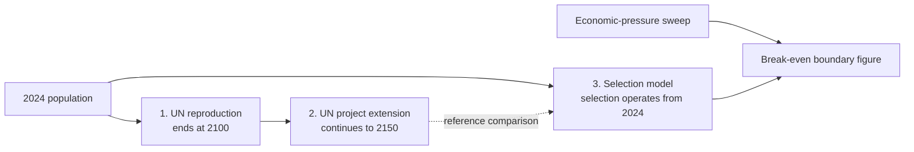

# 06. Researching the mechanism parameters

**Codex** &middot; 2026-08-14 to 2026-08-14 &middot; 19 messages from Dylan, 79 from the model, 507 tool calls.

> Tool output and model reasoning are omitted; see [README](README.md) for what that leaves out and why.

---

### Dylan

Working on the population-model repo. claude has a next task up to bat: research and confirming certain key perameters. See handoff doc in the repo. don't do too much work in your own codex directory, everything should be kept within the repo so a future model will be able to find it

### Model

I’ll pick up the next task from the repository handoff, keep all durable notes and outputs inside the population-model repo, and first inspect its instructions and current state.

<details><summary>9 tool calls</summary>

- `exec — const meta = ALL_TOOLS.filter(x => /claude|agent|repo|handoff/i.test(x.name+" "+x.description)); text(meta);`
- `exec — const r = await tools.shell_command({command:"Get-ChildItem -Force | Select-Object Mode,LastWriteTime,Name;...`
- `exec — const r = await tools.shell_command({command:"$repo='~\\Documents\\Codex\\2026-08-09\\i\\pop...`
- `exec — const r = await tools.shell_command({command:"Get-ChildItem -LiteralPath '~\\Documents\\Code...`
- `exec — const [projects, fs] = await Promise.all([ tools.codex_app__list_projects({}), tools.shell_command({command...`
- `exec — const r = await tools.codex_app__list_projects({}); text(r);`
- `exec — const r = await tools.shell_command({command:"$roots=@('~\\OneDrive\\Documents\\GitHub','C:\...`
- `exec — const r = await tools.shell_command({command:"$repo='~\\Documents\\GitHub\\population-model'...`
- `exec — const r = await tools.shell_command({command:"Get-Content -LiteralPath '~\\Documents\\GitHub...`

</details>

### Model

The handoff confirms the priority: verify the 13 mechanism parameters against their cited literature, without converting unsupported values into “sourced” estimates. I’m reading the exact session task, the parameter table, and the relevant specification sections before researching.

<details><summary>21 tool calls</summary>

- `exec — const r = await tools.shell_command({command:"$repo='~\\Documents\\GitHub\\population-model'...`
- `exec — const r = await tools.shell_command({command:"git status --short; git log -5 --oneline --decorate; git remo...`
- `exec — const r = await tools.web__run({search_query:[ {q:"Murphy 1999 Is the relationship between fertility of par...`
- `exec — const r = await tools.web__run({search_query:[ {q:"site:cbs.gov.il Haredi fertility rate 6.4 2024 Israel CB...`
- `exec — const r = await tools.web__run({open:[ {ref_id:"turn1search3"}, {ref_id:"turn1search6"}, {ref_id:"turn1sear...`
- `exec — const r = await tools.shell_command({command:"rg -n \"mechanism_parameters|mainstream_persistence|group_ret...`
- `exec — const r = await tools.web__run({search_query:[ {q:"\"Is the relationship between fertility of parents and c...`
- `exec — const r = await tools.web__run({search_query:[ {q:"site:humanfertility.org completed fertility distribution...`
- `exec — const r = await tools.web__run({search_query:[ {q:"Haredi leaving community retention rate study Israel rai...`
- `exec — const r = await tools.web__run({search_query:[ {q:"site:cbs.gov.il/en/mediarelease \"Fertility Rates in Isr...`
- `exec — const r = await tools.web__run({open:[{ref_id:"turn6search2"}],response_length:"long"}); text(r);`
- `exec — const r = await tools.web__run({search_query:[ {q:"site:groups.etown.edu/amishstudies \"United States\" \"A...`
- `exec — const r = await tools.web__run({search_query:[ {q:"\"women aged 45–54\" \"Amish\" completed cohort fertilit...`
- `exec — const r = await tools.shell_command({command:"Get-Content -LiteralPath 'src\\popmodel\\mech\\parameters.py'...`
- `exec — const r = await tools.web__run({open:[ {ref_id:"turn5search5"}, {ref_id:"turn5search7"}, {ref_id:"turn3sear...`
- `exec — const r = await tools.shell_command({command:"Get-ChildItem -LiteralPath data -Recurse -Depth 2 | Where-Obj...`
- `exec — const r = await tools.web__run({find:[ {ref_id:"turn3search2","pattern":"doi"}, {ref_id:"turn3search2","pat...`
- `exec — const r = await tools.web__run({search_query:[ {q:"\"Cross-National Patterns of Intergenerational Continuit...`
- `exec — const r = await tools.update_plan({plan:[ {step:"Audit the eight sourced parameter rows against primary/aut...`
- `exec — const r = await tools.shell_command({command:"git -c safe.directory=~/Documents/GitHub/populat...`
- `exec — const r = await tools.shell_command({command:"Get-Content -LiteralPath 'tests\\test_mech.py' | Select-Objec...`

</details>

### Model

The audit is converging on seven defensible sourced rows. Two material corrections emerged: whole-population Haredi retention is closer to 86.7% than 90%, and the new population-wide Amish study supports about 6.1 births per woman and 84.5% lifelong retention. The mainstream fertility-spread parameter still cannot honestly be confirmed from the cited recollection, so I’ll leave that row unverified; all five scenario knobs also remain unverified by design.

<details><summary>6 tool calls</summary>

- `exec — const patch = "*** Begin Patch\n*** Update File: ~\\Documents\\GitHub\\population-model\\dat...`
- `exec — const r = await tools.shell_command({command:"git -c safe.directory=~/Documents/GitHub/populat...`
- `exec — const r = await tools.shell_command({command:"rg -n \"all marked|every one currently|thirteen rows|none che...`
- `exec — const patch = "*** Begin Patch\n*** Update File: ~\\Documents\\GitHub\\population-model\\CLA...`
- `exec — const r = await tools.update_plan({explanation:"The source audit is complete: seven sourced rows are defens...`
- `exec — const r = await tools.shell_command({command:"git -c safe.directory=~/Documents/GitHub/populat...`

</details>

### Model

The repository edits are in place and the source trail is now durable. The first check hit the machine’s bare Python installation, which lacks the project test packages; I’m switching to the repository’s recorded local runtime rather than installing anything or writing outside the repo.

<details><summary>13 tool calls</summary>

- `exec — const r = await tools.shell_command({command:"Get-Content -LiteralPath 'LOCAL_TOOLS.md' -Raw; Get-ChildItem...`
- `exec — const r = await tools.shell_command({command:"python -m pytest tests/test_mech.py -q","workdir":"C:\\Users\...`
- `exec — const r = await tools.shell_command({command:"where.exe python; py -0p; Get-ChildItem -Path 'C:\\Users\\dsl...`
- `exec — const r = await tools.shell_command({command:"py -3.11 -m pytest tests/test_mech.py -q","workdir":"C:\\User...`
- `exec — const r = await tools.codex_app__load_workspace_dependencies({}); text(r);`
- `exec — const r = await tools.shell_command({command:"& '~\\.cache\\codex-runtimes\\codex-primary-ru...`
- `exec — const r = await tools.shell_command({command:"Get-Content -LiteralPath 'pyproject.toml' -Raw; python -c \"i...`
- `exec — const r = await tools.shell_command({command:"Get-ChildItem -LiteralPath '~\\Documents\\Code...`
- `exec — const r = await tools.shell_command({command:"Get-Content -LiteralPath '.gitignore' -Raw; py -3.11 -m pip -...`
- `exec — const r = await tools.shell_command({command:"& '~\\AppData\\Local\\Programs\\Python\\Python...`
- `exec — const r = await tools.shell_command({command:"& '~\\AppData\\Local\\Programs\\Python\\Python...`
- `exec — const r = await tools.shell_command({command:"& '.\\.venv\\Scripts\\python.exe' -m pytest tests/test_mech.p...`
- `exec — const r = await tools.shell_command({command:"& '.\\.venv\\Scripts\\python.exe' -m pytest tests -q","workdi...`

</details>

### Model

All 152 tests pass. I’m now rerunning the Phase 5 grid with the corrected central values so the repository’s local results and caveat reflect the audit; after that I’ll compare the substantive changes and update the handoff with the new figures rather than leaving stale numbers behind.

<details><summary>22 tool calls</summary>

- `exec — const r = await tools.shell_command({command:"& '.\\.venv\\Scripts\\python.exe' scripts\\run_phase5.py","wo...`
- `exec — const r = await tools.shell_command({command:"rg -n \"Every mechanism parameter|13 mechanism|unverified|0\\...`
- `exec — const r = await tools.shell_command({command:"Get-Content -LiteralPath 'scripts\\build_map.py' | Select-Obj...`
- `exec — const patch = "*** Begin Patch\n*** Update File: ~\\Documents\\GitHub\\population-model\\scr...`
- `exec — const r = await tools.shell_command({command:"& '.\\.venv\\Scripts\\python.exe' scripts\\plot_phase5.py; & ...`
- `exec — const imgs = await Promise.all([ tools.view_image({path:"~\\Documents\\GitHub\\population-mo...`
- `exec — const r = await tools.shell_command({command:"rg -n \"caveat|figtext|text\\(\" scripts\\plot_phase5.py; Get...`
- `exec — const patch = "*** Begin Patch\n*** Update File: ~\\Documents\\GitHub\\population-model\\scr...`
- `exec — const r = await tools.shell_command({command:"Get-Content -LiteralPath 'scripts\\plot_phase5.py' -First 28"...`
- `exec — const patch = "*** Begin Patch\n*** Update File: ~\\Documents\\GitHub\\population-model\\scr...`
- `exec — const r = await tools.shell_command({command:"& '.\\.venv\\Scripts\\python.exe' scripts\\plot_phase5.py; & ...`
- `exec — const im = await tools.view_image({path:"~\\Documents\\GitHub\\population-model\\out\\phase5...`
- `exec — const r = await tools.shell_command({command:"rg -n \"Every mechanism parameter|all thirteen|all marked `ve...`
- `exec — const r = await tools.shell_command({command:"Get-Content -LiteralPath 'scripts\\plot_decomposition.py' | S...`
- `exec — const patch = "*** Begin Patch\n*** Update File: ~\\Documents\\GitHub\\population-model\\scr...`
- `exec — const r = await tools.shell_command({command:"& '.\\.venv\\Scripts\\python.exe' scripts\\plot_decomposition...`
- `exec — const im = await tools.view_image({path:"~\\Documents\\GitHub\\population-model\\out\\decomp...`
- `exec — const r = await tools.shell_command({command:"rg -n 'all thirteen of its parameters are unverified|Every me...`
- `exec — const patch = "*** Begin Patch\n*** Update File: ~\\Documents\\GitHub\\population-model\\doc...`
- `exec — const r = await tools.shell_command({command:"& '.\\.venv\\Scripts\\python.exe' -c \"from popmodel.mech.par...`
- `exec — const r = await tools.shell_command({command:"& '.\\.venv\\Scripts\\python.exe' -c \"import sys; sys.path.i...`
- `exec — const r = await tools.shell_command({command:"& '.\\.venv\\Scripts\\python.exe' -m pytest tests -q","workdi...`

</details>

### Model

The corrected grid remains substantively unchanged at world scale (the combined “race” scenario is still 7.75 billion in 2150), while the documentation and page now disclose the verified/unverified split accurately. The rebuilt figures look clean, map QA passes, and the final full suite is 152/152. I’m doing the repository’s required commit-and-push handoff now.

<details><summary>6 tool calls</summary>

- `exec — const r = await tools.shell_command({command:"git -c safe.directory=~/Documents/GitHub/populat...`
- `exec — const r = await tools.shell_command({command:"Get-Content -LiteralPath 'docs\\mechanism-parameter-audit.md'...`
- `exec — const r = await tools.shell_command({command:"git -c safe.directory=~/Documents/GitHub/populat...`
- `exec — const r = await tools.shell_command({command:"git -c safe.directory=~/Documents/GitHub/populat...`
- `exec — const r = await tools.shell_command({command:"git -c safe.directory=~/Documents/GitHub/populat...`
- `exec — const r = await tools.update_plan({explanation:"The audit, corrected table, refreshed Phase 5 outputs/page,...`

</details>

### Model

Completed in the population-model repo and committed as `689624b`.

- Verified 7 of 8 sourced parameters.
- Corrected Haredi retention to 0.867 and Amish fertility/retention to 6.10/0.845.
- Left `mainstream_propensity_cv` unverified pending cohort-parity data.
- Kept all five scenario knobs unverified.
- Added the durable [parameter audit](~/Documents/GitHub/population-model/docs/mechanism-parameter-audit.md).
- Rebuilt Phase 5 figures and the webpage; the world-scale result remains 7.75 billion in 2150.
- Full suite: 152 tests passed; map QA passed; working tree is clean.

The research uses [Murphy 2013](https://doi.org/10.1080/19485565.2013.833779), [Israel Democracy Institute](https://en.idi.org.il/articles/32775), [Anderson and Thiehoff 2025](https://doi.org/10.1080/00324728.2025.2592576), and the [Young Center](https://groups.etown.edu/amishstudies/population-2024/).

The commit is one ahead of `origin/main`. Pushing requires your explicit approval—tell me to push it if you want it published.

### Dylan

Great job, yes. Yes you can push, we should be on main. what is the difference between commit and push?

### Model

Yes—we’re on `main`. A commit records the changes locally in the repository’s history; a push uploads that commit to the remote GitHub repository so other machines and future sessions can see it. I’ll push the existing commit now, then confirm local and remote `main` match.

<details><summary>2 tool calls</summary>

- `exec — const r = await tools.shell_command({command:"git -c safe.directory=~/Documents/GitHub/populat...`
- `exec — const r = await tools.shell_command({command:"git -c safe.directory=~/Documents/GitHub/populat...`

</details>

### Model

Pushed successfully. Local `main` and GitHub’s `origin/main` now match at commit `689624b`.

- **Commit:** saves a named checkpoint locally.
- **Push:** sends local commits to GitHub for sharing and backup.

Think “save” versus “publish.”

### Dylan

great! hub.dylanslagh.com is where I usually view stuff. there is a repo called project-hub. can you read the instructions there and commit them to some longer term memory for chatgpt so I don't have to remind you to? The memory should be something like "when working on one of dylan's projects, check for the instructions in the project-hub repo. that is the offical location and my own instructions can sometimes be out of date"

### Model

I’m using the OpenAI/Codex guidance skill because this involves persistent ChatGPT memory and where future agents should look for your authoritative instructions. I’ll first inspect the project-hub instructions, then check what persistent-memory capability is actually available before saving anything.

<details><summary>4 tool calls</summary>

- `exec — const r = await tools.shell_command({command:"Get-Content -LiteralPath '~\\.codex\\skills\\....`
- `exec — const r = await tools.web__run({search_query:[ {q:"site:learn.chatgpt.com ChatGPT memory saved memories how...`
- `exec — const r = await tools.shell_command({command:"Get-Content -LiteralPath '~\\.codex\\skills\\....`
- `exec — const r = await tools.web__run({open:[{ref_id:"https://learn.chatgpt.com/docs/use-chatgpt"}],response_lengt...`

</details>

### Model

I’m confirming the exact persistence mechanism now, then I’ll save the instruction in the form future project sessions can actually inherit.

<details><summary>4 tool calls</summary>

- `exec — const r = await tools.web__run({click:[ {ref_id:"turn14view0",id:270}, {ref_id:"turn14view0",id:277} ],resp...`
- `exec — const r = await tools.web__run({open:[ {ref_id:"turn15view1",lineno:760}, {ref_id:"turn15view0",lineno:785}...`
- `exec — const r = await tools.shell_command({command:"Get-ChildItem -LiteralPath '~\\Documents\\GitH...`
- `exec — const r = await tools.shell_command({command:"Get-Content -LiteralPath '~\\Documents\\GitHub...`

</details>

### Model

The project-hub instruction file is very clear: it is the authoritative source, it can change from Dylan’s phone, and any conflicting memory should yield to it. I’m going to store only that pointer—not duplicate the whole file—so the source cannot drift.

<details><summary>6 tool calls</summary>

- `exec — const r = await tools.shell_command({command:"$agentPath = '~\\.codex\\AGENTS.md'; $configPa...`
- `exec — const hits = ALL_TOOLS.filter(x => /memory|memories|remember|personaliz|agent.*instruction|instruction.*age...`
- `exec — const patch = "*** Begin Patch\n*** Update File: ~\\.codex\\AGENTS.md\n@@\n+# Dylan's projec...`
- `exec — const r = await tools.shell_command({command:"git fetch origin main","workdir":"~\\Documents...`
- `exec — const r = await tools.shell_command({command:"git status --short --branch; git rev-parse HEAD; git rev-pars...`
- `exec — const r = await tools.shell_command({command:"git -c safe.directory='~/Documents/GitHub/projec...`

</details>

### Model

Done. I verified `project-hub` against the latest GitHub `main`, read its instructions, and saved this durable rule in `~\.codex\AGENTS.md`:

> When working on Dylan’s projects, first reread `project-hub/USER-INSTRUCTIONS.md`. Treat it as authoritative over memories, old conversations, or stale repository instructions.

I also recorded that you review work at `hub.dylanslagh.com`. This pointer is intentionally not a second copy of your instructions, so it won’t drift. Future Codex project sessions on Dylan’s Computer will inherit it automatically, which is the recommended use of global `AGENTS.md` guidance. [OpenAI documentation](https://learn.chatgpt.com/docs/agent-configuration/agents-md)

I did not alter or commit anything in `project-hub`.

### Dylan

Ok! well I'd like changes you made in population-model to be reflected there. I can see it still says last change august 12 (yesterday)

### Model

I’ll trigger the project-hub rebuild from GitHub so it pulls the population-model commit we pushed today, then I’ll verify the publish finishes successfully. I’m using the GitHub workflow guidance for this publish step.

<details><summary>2 tool calls</summary>

- `exec — const r = await tools.shell_command({command:"Get-Content -LiteralPath '~\\.codex\\plugins\\...`
- `exec — const r = await tools.shell_command({command:"gh workflow run \"Publish the hub\" --repo dylanslagh/project...`

</details>

### Model

The rebuild is now running. I have the exact GitHub publish job and am checking it through completion rather than assuming the site updated.

<details><summary>3 tool calls</summary>

- `exec — const r = await tools.shell_command({command:"gh run watch 31757843620 --repo dylanslagh/project-hub --exit...`
- `exec — const r = await tools.shell_command({command:"gh run view 31757843620 --repo dylanslagh/project-hub --json ...`
- `exec — const r = await tools.shell_command({command:"gh run view 31757843620 --repo dylanslagh/project-hub --log |...`

</details>

### Model

Fixed—it’s live now at [hub.dylanslagh.com](https://hub.dylanslagh.com).

The hub rebuild completed successfully and included `population-model`. It was stale because pushing that repository doesn’t automatically rebuild the separate project-hub site; I’ve now triggered that missing publish step. Refresh the page and it should show today’s changes.

### Dylan

Great! Now there are three end goals for this project: website, youtube video, and paper. Is there anything that should be worked on before we start on any of those? Let's discuss together

### Model

Yes—before choosing the website, video, or paper, I want to identify the shared foundation all three would depend on. I’ll quickly reread the current population-model handoff and project instructions, then we can decide together which prerequisites are truly necessary versus optional polish.

<details><summary>5 tool calls</summary>

- `exec — const r = await tools.shell_command({command:"Get-Content -LiteralPath '~\\Documents\\GitHub...`
- `exec — const r = await tools.shell_command({command:"Get-Content -LiteralPath 'CLAUDE.md' -Raw; Get-Content -Liter...`
- `exec — const r = await tools.shell_command({command:"Get-Content -LiteralPath 'NEXT_SESSION.md' -Raw; Get-Content ...`
- `exec — const r = await tools.shell_command({command:"Select-String -LiteralPath 'HANDOFF.md' -Pattern '^## |^### '...`
- `exec — const r = await tools.shell_command({command:"$lines = Get-Content -LiteralPath 'HANDOFF.md'; $lines[246..2...`

</details>

### Model

There is no large hidden engineering phase left. The model works, its checks pass, and phases 1–5 are complete. I think we should do two things before serious production begins.

First, finish the one unresolved empirical parameter: `mainstream_propensity_cv`. It measures how much people vary in their underlying fertility propensity. It is both unverified and influential, so numbers such as the 7.75-billion result remain conditional on it.

Second, do a short publication-readiness stress test. For every possible headline claim, we should ask:

- Does it survive reasonable values for the remaining scenario knobs?
- What changes when migration uncertainty is included?
- Does the selection result survive if economic pressure affects high-propensity people differently?
- How much do the simplified starting age structures for Amish and Haredi populations matter?
- Is the result a finding, an assumption, or merely an illustrative scenario?

That should produce a small “claims ledger”: each important number, its evidence, its sensitivity, and the caveat that must travel with it. Then the website, paper, and video can all draw from one frozen set of results without quietly disagreeing.

Some things are not blockers:

- Phase 6 scoring cannot happen until new observations arrive years from now.
- The incomplete census-confidence layer can remain incomplete if labeled.
- The public hostname and license only need decisions before launch.
- The YouTube race uses UN figures through 2100, so it does not depend directly on the mechanism parameter. We only need to decide whether annual births should be its second act.

My preferred central story for the website and paper is:

> Population in 2150 is not chiefly uncertain because today’s population counts are imprecise. It is uncertain because different assumptions about long-run fertility mechanisms compound into radically different futures.

The selection-versus-development result then becomes the most interesting demonstration of that idea, rather than the entire thesis. The video can be an accessible companion built from UN data, rather than pretending to prove the paper’s argument.

Does that feel like the right center of gravity, or do you see the selection-versus-development contest as the project’s main story?

### Dylan

I've been pretty hands off for a lot of the project up till now. The project spec came out of a series of conversations with both claude and chatgpt, so I'm not actually that well aware of the overall structure of the project. Let's start with mainstream_propensity_cv. What should I know?

### Model

Absolutely. I’ll trace this parameter from its plain-language meaning through the model’s math and results, then separate what is genuinely observed from what the project currently assumes. I’ll keep the explanation biological and intuitive, with only the minimum math needed.

<details><summary>2 tool calls</summary>

- `exec — const r = await tools.shell_command({command:"Select-String -LiteralPath 'data\\reference\\mechanism_parame...`
- `exec — const r = await tools.shell_command({command:"Get-ChildItem -LiteralPath 'out' -File | Select-Object Name,L...`

</details>

### Model

I’ve confirmed why this parameter matters: it is not the average number of children. It controls how far apart the model’s low-, middle-, and high-fertility mainstream groups are. The current value of 0.60 is plausible, but it was never calculated from a named cohort dataset—so the model is treating the strength of selection as more certain than the evidence warrants.

<details><summary>5 tool calls</summary>

- `exec — const r = await tools.shell_command({command:"$lines = Get-Content -LiteralPath 'src\\popmodel\\mech\\compo...`
- `exec — const r = await tools.shell_command({command:"@'\nimport math\n\ndef cdf(x): return 0.5*(1+math.erf(x/math....`
- `exec — const r = await tools.shell_command({command:"$p = Get-Content -LiteralPath 'out\\phase5.json' -Raw | Conve...`
- `exec — const r = await tools.shell_command({command:"$lines = Get-Content -LiteralPath 'spec\\population-2150-spec...`
- `exec — const r = await tools.shell_command({command:"Select-String -LiteralPath 'spec\\population-2150-spec-v0.3.m...`

</details>

### Model

The simplest way to think about `mainstream_propensity_cv` is:

> How different are ordinary people from one another in their tendency to have children?

It is important because variation is the fuel for selection. If everyone has roughly the same fertility, population composition barely changes. If some people reliably have many more children than others—and some of that difference persists between generations—the higher-fertility tendencies become more common.

### What the model currently does

The model divides the general population into three invisible categories: low, middle, and high fertility propensity. These are not social, religious, political, or genetic labels. They are simplified statistical types.

“Propensity” is expressed relative to each country’s average fertility. With the current CV of `0.60`, the three types are approximately:

| Type | Relative fertility | Illustration if average is 2 children |
|---|---:|---:|
| Low | 0.36× average | 0.7 children |
| Middle | 0.83× average | 1.7 children |
| High | 1.80× average | 3.6 children |

The example is only to make the scale understandable. The model operates on national fertility rates, not literal fractional families.

Each type initially represents one-third of the mainstream population. Because the high type has more children, its share increases. The separate `mainstream_persistence` parameter says how strongly parent and child fertility are related. Its current value is 0.15, based on published parent–child correlations.

Together, dispersion and persistence create the selection effect:

- `mainstream_propensity_cv` says how far apart the types are.
- `mainstream_persistence` says how much of that ordering survives into the next generation.

By 2150, the current model moves the high-propensity mainstream type from 33% to roughly 45% of the world population. Under the declining-development scenario, selection raises the result from about 6.37 billion to 7.75 billion. Under the UN fertility environment, it raises it from 8.78 billion to about 10.9 billion.

Those differences are not caused by this parameter alone, but it is one of the principal drivers.

### What “CV” means

CV means coefficient of variation:

> standard deviation ÷ average

A CV of 0.60 means that if completed family size averages 2 children, its standard deviation is 1.2 children.

CV is useful because it describes relative spread. A population averaging 1.5 children and one averaging 3 children can have the same CV even though their absolute numbers differ.

Selection initially grows approximately with the square of the CV. That makes the current uncertainty range consequential:

- CV 0.45 produces types around 0.51×, 0.90×, and 1.59×.
- CV 0.60 produces 0.36×, 0.83×, and 1.80×.
- CV 0.80 produces 0.19×, 0.73×, and 2.09×.

Moving from 0.45 to 0.80 creates more than three times as much statistical variance. This is why we cannot casually leave the parameter unresolved.

### What is wrong with the current value

The value `0.60` is plausible, but it came from a recollection that completed family size often has a mean around 1.8–2.0 and a standard deviation around 1.1–1.3. No particular country, cohort, or table was recorded.

That leaves several important questions unanswered:

- Were childless women included?
- Was the unit women, married women, couples, or families?
- Was this completed fertility, or a period fertility measurement?
- How was an open category such as “six or more children” handled?
- Was the variation consistent across countries and birth cohorts?
- How much of the variation represents a persistent tendency rather than infertility, partnership circumstances, policy, chance, or other temporary conditions?

That last distinction is especially important. The data can directly measure variation in completed family size. The code calls this variation “propensity,” which sounds like a stable underlying trait. Those are not automatically the same thing.

The separate parent–child correlation partly protects us: most differences are not transmitted. But we should still be explicit about whether the model is representing observed reproductive variation or claiming to measure a deeper preference.

### What the research should produce

I would not approach this as “find a citation supporting 0.60.” We should calculate it ourselves from completed-cohort parity distributions.

A good result would include:

1. Several completed birth cohorts from multiple low-fertility countries.
2. The proportion of women with 0, 1, 2, 3, and successively more children.
3. A transparent treatment of the highest open-ended category.
4. The mean, standard deviation, and CV for every country and cohort.
5. A chart showing whether dispersion is stable or changing.
6. A sensitivity test showing what the model says using the observed range.
7. A decision about whether one worldwide CV is defensible—or whether the model needs country-specific values or a probability distribution.

We should include all women, including childless women. Restricting the calculation to mothers would remove exactly the low-fertility part of the distribution that selection acts on.

The biggest conceptual question is therefore not “Is the answer 0.60?” It is:

> Does observed variation in completed family size provide a defensible representation of persistent fertility propensity?

My recommendation is to test that premise while measuring the number, rather than accepting the model’s terminology in advance.

### Dylan

Good explanation, I'm on board with your agenda, I give you full permission to do your best research. I'm here if you run into trouble, it seems like a hard problem to me so I understand if there are hiccups that need to be adjudicated or web interfaces that need a human eye and hands. अब जाओ

### Model

I’m starting the full research pass now. The first question is empirical—what completed-cohort parity data we can retrieve reproducibly—then I’ll test the deeper modeling assumption that observed family-size variance is a reasonable stand-in for latent, partly transmitted fertility propensity. All durable notes, code, and source records will stay in `population-model`.

<details><summary>5 tool calls</summary>

- `exec — const r = await tools.update_plan({plan:[ {step:"Identify primary completed-cohort parity datasets and thei...`
- `exec — const r = await tools.web__run({search_query:[ {q:"Human Fertility Database cohort parity distribution data...`
- `exec — const r = await tools.web__run({open:[ {ref_id:"turn17search1"}, {ref_id:"turn17search12"}, {ref_id:"turn17...`
- `exec — const r = await tools.web__run({click:[ {ref_id:"turn18view0",id:29}, {ref_id:"turn18view2",id:76}, {ref_id...`
- `exec — const r = await tools.web__run({search_query:[ {q:"site:eurrep.org/database \"Get input data as CSV\""}, {q...`

</details>

### Model

The first access issue is real but manageable: the Human Fertility Database’s bulk files require a personal account, while the Cohort Fertility and Education Database offers comparable census/survey tabulations without registration. I’m using the browser-control skill to inspect that public download interface and avoid asking you to create an account unless it proves scientifically necessary.

<details><summary>26 tool calls</summary>

- `exec — const r = await tools.shell_command({command:"Get-Content -LiteralPath '~\\.codex\\plugins\\...`
- `exec — const hits=ALL_TOOLS.filter(x=>/node.?repl|tool.?search/i.test((x.name||"")+" "+(x.description||""))).map(x...`
- `exec — // @exec: {"max_output_tokens": 20000} const r = await tools.mcp__node_repl__js({code:`if (globalThis.agent...`
- `exec — const r = await tools.mcp__node_repl__js({code:`globalThis.eurrepTab = await browser.tabs.new(); await eurr...`
- `exec — const r = await tools.mcp__node_repl__js({code:`await eurrepTab.goto("https://www.eurrep.org/database/datab...`
- `exec — const r = await tools.mcp__node_repl__js({code:`var selectInfo = await eurrepTab.playwright.locator("select...`
- `exec — const r = await tools.web__run({open:[ {ref_id:"https://zozlak.org/eurrep/database.js"} ],response_length:"...`
- `exec — const r = await tools.mcp__node_repl__js({code:`globalThis.eurrepJsTab = await browser.tabs.new(); await eu...`
- `exec — const r = await tools.shell_command({command:"Invoke-WebRequest -Uri 'https://zozlak.org/eurrep/database.js...`
- `exec — const r = await tools.shell_command({command:"Invoke-WebRequest -Uri 'https://zozlak.org/eurrep/database.ph...`
- `exec — const r = await tools.mcp__node_repl__js({code:`await eurrepTab.playwright.locator('select[name="db_country...`
- `exec — const r = await tools.shell_command({command:"Get-ChildItem -LiteralPath 'src\\popmodel\\sources' -File | S...`
- `exec — const r = await tools.web__run({search_query:[ {q:"Michael Murphy 2013 Cross-National Patterns Intergenerat...`
- `exec — const r = await tools.web__run({find:[ {ref_id:"turn22search13","pattern":"DATA AND METHODS"}, {ref_id:"tur...`
- `exec — const r = await tools.web__run({open:[ {ref_id:"turn22search12"} ],response_length:"long"}); text(r)`
- `exec — const r = await tools.web__run({open:[ {ref_id:"turn24view0","lineno":250}, {ref_id:"turn24view0","lineno":...`
- `exec — const r = await tools.web__run({open:[ {ref_id:"turn22search4"} ],response_length:"long"}); text(r)`
- `exec — const r = await tools.web__run({search_query:[ {q:"\"How does variance in fertility change over the demogra...`
- `exec — const r = await tools.shell_command({command:"$resp = Invoke-WebRequest -Uri 'https://zozlak.org/eurrep/Fin...`
- `exec — const r = await tools.web__run({open:[ {ref_id:"turn20search12"} ],response_length:"long"}); text(r)`
- `exec — const r = await tools.shell_command({command:"Get-Content -LiteralPath 'pyproject.toml' -Raw; Get-ChildItem...`
- `exec — const r = await tools.shell_command({command:"$resp = Invoke-WebRequest -Uri 'https://ftp.cdc.gov/pub/Healt...`
- `exec — const r = await tools.shell_command({command:"$resp = Invoke-WebRequest -Uri 'https://ftp.cdc.gov/pub/Healt...`
- `exec — const r = await tools.codex_app__load_workspace_dependencies({}); text(r)`
- `exec — const r = await tools.shell_command({command:"Get-Content -LiteralPath 'tests\\conftest.py' -Raw; & 'C:\\Us...`
- `exec — const r = await tools.shell_command({command:"py -0p; Get-Command python -All | Select-Object Source; Get-C...`

</details>

### Model

The public database is strong enough to proceed without your intervention: it exposes absolute counts of women by birth cohort and completed number of children for 45 countries, including childless women. I’m now building a reproducible reader around those official downloads. The raw tabulations will remain uncommitted, as the database’s terms require; only checksums, derived summaries, and analysis code will enter the repository.

<details><summary>10 tool calls</summary>

- `exec — const patch = "*** Begin Patch\n*** Add File: ~\\Documents\\GitHub\\population-model\\src\\p...`
- `exec — const r = await tools.shell_command({command:"python scripts\\fetch_cfe.py","workdir":"~\\Do...`
- `exec — const r = await tools.shell_command({command:"python -m pip install --upgrade -r requirements.txt","workdir...`
- `exec — const r = await tools.shell_command({command:"python -m pip install \"numpy>=1.26\" \"pandas>=2.0\" \"pytes...`
- `exec — const r = await tools.shell_command({command:"python -m pytest tests\\test_cfe.py -q","workdir":"C:\\Users\...`
- `exec — const patch = "*** Begin Patch\n*** Update File: ~\\Documents\\GitHub\\population-model\\tes...`
- `exec — const r = await tools.shell_command({command:"python -m pytest tests\\test_cfe.py -q --basetemp .codex-pyte...`
- `exec — const patch = "*** Begin Patch\n*** Update File: ~\\Documents\\GitHub\\population-model\\tes...`
- `exec — const patch = "*** Begin Patch\n*** Update File: ~\\Documents\\GitHub\\population-model\\.gi...`
- `exec — const patch = "*** Begin Patch\n*** Add File: ~\\Documents\\GitHub\\population-model\\script...`

</details>

### Model

I’m continuing from the data-collection stage. The public fertility archive is now mirrored locally inside the repository (raw copies excluded from Git); I’m checking the extractor and then I’ll use the results to decide whether the model’s `0.60` represents the right quantity—or just happens to be numerically plausible.

<details><summary>9 tool calls</summary>

- `exec — const r = await tools.shell_command({command:"Get-ChildItem -Force; git -c safe.directory=~/Do...`
- `exec — const r = await tools.shell_command({command:"python -m pytest tests\\test_cfe.py -q --basetemp .codex-pyte...`
- `exec — const r = await tools.shell_command({command:"python scripts\\analyze_cfe_dispersion.py","workdir":"C:\\Use...`
- `exec — const r = await tools.shell_command({command:"Get-Content src\\popmodel\\paths.py; Get-Content src\\popmode...`
- `exec — const patch = "*** Begin Patch\n*** Update File: ~\\Documents\\GitHub\\population-model\\scr...`
- `exec — const patch = "*** Begin Patch\n*** Update File: ~\\Documents\\GitHub\\population-model\\scr...`
- `exec — const r = await tools.shell_command({command:"Select-String -Path scripts\\analyze_cfe_dispersion.py -Patte...`
- `exec — const r = await tools.shell_command({command:"python scripts\\analyze_cfe_dispersion.py","workdir":"C:\\Use...`
- `exec — const r = await tools.shell_command({command:"python -c \"import pandas as pd; p='data/raw/CFE/albania_2011...`

</details>

### Model

The first real-data failure is useful: it exposed two archive conventions the toy tests didn’t capture. Empty parity cells are omitted, and some census-weighted totals are rounded by a few hundredths. I’m tightening the reader so the highest category is defined at the dataset level and only sub-person rounding discrepancies are reconciled; material inconsistencies will still stop the run.

<details><summary>9 tool calls</summary>

- `exec — const patch = "*** Begin Patch\n*** Update File: ~\\Documents\\GitHub\\population-model\\src...`
- `exec — const r = await tools.shell_command({command:"Get-Content tests\\test_cfe.py","workdir":"~\\...`
- `exec — const patch = "*** Begin Patch\n*** Update File: ~\\Documents\\GitHub\\population-model\\tes...`
- `exec — const t = await tools.shell_command({command:"python -m pytest tests\\test_cfe.py -q --basetemp .codex-pyte...`
- `exec — const r = await tools.shell_command({command:"python scripts\\analyze_cfe_dispersion.py","workdir":"C:\\Use...`
- `exec — const patch = "*** Begin Patch\n*** Update File: ~\\Documents\\GitHub\\population-model\\src...`
- `exec — const r = await tools.shell_command({command:"python scripts\\analyze_cfe_dispersion.py","workdir":"C:\\Use...`
- `exec — const patch = "*** Begin Patch\n*** Update File: ~\\Documents\\GitHub\\population-model\\scr...`
- `exec — const r = await tools.shell_command({command:"python scripts\\analyze_cfe_dispersion.py","workdir":"C:\\Use...`

</details>

### Model

A second archive convention appeared in the German microcensus: public cells are rounded to the nearest thousand, so parity cells and their separately rounded total can differ by one thousand without conflicting. I’m treating reporting precision as source metadata—not weakening validation globally—so a true discrepancy in an exact-count census will still fail.

<details><summary>11 tool calls</summary>

- `exec — const r = await tools.shell_command({command:"python -c \"import math,sys,pandas as pd; from pathlib import...`
- `exec — const r = await tools.shell_command({command:"python -c \"import pandas as pd; d=pd.read_csv('data/raw/CFE/...`
- `exec — const r = await tools.shell_command({command:"python -c \"import pandas as pd; \nfor k in ['argentina_2001'...`
- `exec — const patch = "*** Begin Patch\n*** Update File: ~\\Documents\\GitHub\\population-model\\src...`
- `exec — const t = await tools.shell_command({command:"python -m pytest tests\\test_cfe.py -q --basetemp .codex-pyte...`
- `exec — const patch = "*** Begin Patch\n*** Update File: ~\\Documents\\GitHub\\population-model\\tes...`
- `exec — const t = await tools.shell_command({command:"python -m pytest tests\\test_cfe.py -q --basetemp .codex-pyte...`
- `exec — const r = await tools.shell_command({command:"python scripts\\analyze_cfe_dispersion.py","workdir":"C:\\Use...`
- `exec — const r = await tools.shell_command({command:"python -c \"import pandas as pd; d=pd.read_csv('data/raw/CFE/...`
- `exec — const patch = "*** Begin Patch\n*** Update File: ~\\Documents\\GitHub\\population-model\\src...`
- `exec — const r = await tools.shell_command({command:"python scripts\\analyze_cfe_dispersion.py","workdir":"C:\\Use...`

</details>

### Model

The archive audit is still progressing across the national files. So far the “fail loudly” checks have caught only documented data-format behavior—rounded weighted counts and omitted exact zeros—not a scientific inconsistency. The reader now records those conventions explicitly while retaining strict checks on identities that should hold.

<details><summary>16 tool calls</summary>

- `exec — const patch = "*** Begin Patch\n*** Update File: ~\\Documents\\GitHub\\population-model\\src...`
- `exec — const r = await tools.shell_command({command:"python scripts\\analyze_cfe_dispersion.py","workdir":"C:\\Use...`
- `exec — const r = await tools.shell_command({command:"python -c \"import pandas as pd; d=pd.read_csv('data/raw/CFE/...`
- `exec — const patch = "*** Begin Patch\n*** Update File: ~\\Documents\\GitHub\\population-model\\src...`
- `exec — const patch = "*** Begin Patch\n*** Update File: ~\\Documents\\GitHub\\population-model\\src...`
- `exec — const r = await tools.shell_command({command:"Get-Content src\\popmodel\\ingest\\cfe.py | Select-Object -Sk...`
- `exec — const patch = "*** Begin Patch\n*** Update File: ~\\Documents\\GitHub\\population-model\\src...`
- `exec — const patch = "*** Begin Patch\n*** Update File: ~\\Documents\\GitHub\\population-model\\src...`
- `exec — const r = await tools.shell_command({command:"python scripts\\analyze_cfe_dispersion.py","workdir":"C:\\Use...`
- `exec — const patch = "*** Begin Patch\n*** Update File: ~\\Documents\\GitHub\\population-model\\src...`
- `exec — const r = await tools.shell_command({command:"python scripts\\analyze_cfe_dispersion.py","workdir":"C:\\Use...`
- `exec — const patch = "*** Begin Patch\n*** Update File: ~\\Documents\\GitHub\\population-model\\src...`
- `exec — const r = await tools.shell_command({command:"python scripts\\analyze_cfe_dispersion.py","workdir":"C:\\Use...`
- `exec — const r = await tools.shell_command({command:"python -c \"import pandas as pd, re; from pathlib import Path...`
- `exec — const patch = "*** Begin Patch\n*** Update File: ~\\Documents\\GitHub\\population-model\\scr...`
- `exec — const r = await tools.shell_command({command:"python scripts\\analyze_cfe_dispersion.py","workdir":"C:\\Use...`

</details>

### Model

We have the first complete result: 43 usable countries, with 19 in the model-relevant low-fertility subset. Their median completed-family-size CV is `0.570`; weighting by the number of women gives `0.555`. The old `0.60` assumption is therefore surprisingly close—but the important remaining question is how much of that observed spread the model is entitled to call a persistent “propensity.” I’m testing that interpretation next.

<details><summary>22 tool calls</summary>

- `exec — const r = await tools.shell_command({command:"python -c \"import json,pandas as pd; j=json.load(open('data/...`
- `exec — const r = await tools.shell_command({command:"Get-Content data\\reference\\mechanism_parameters.csv; Get-Co...`
- `exec — const r = await tools.shell_command({command:"Get-Content docs\\mechanism-parameter-audit.md | Select-Objec...`
- `exec — const res = await tools.web__run({open:[{ref_id:"https://ftp.cdc.gov/pub/Health_Statistics/NCHS/nvss/birth/...`
- `exec — const res = await tools.web__run({search_query:[{q:"site:cdc.gov/nchs/data/nvsr cohort fertility tables Tab...`
- `exec — const patch = "*** Begin Patch\n*** Add File: ~\\Documents\\GitHub\\population-model\\src\\p...`
- `exec — const r = await tools.shell_command({command:"python scripts\\fetch_cdc_cohort.py","workdir":"C:\\Users\\ds...`
- `exec — const r = await tools.shell_command({command:"Get-Content data\\raw\\CDC\\Table03.csv -TotalCount 25; pytho...`
- `exec — const r = await tools.shell_command({command:"python -c \"import pandas as pd; d=pd.read_csv('data/raw/CDC/...`
- `exec — const patch = "*** Begin Patch\n*** Update File: ~\\Documents\\GitHub\\population-model\\src...`
- `exec — const r = await tools.shell_command({command:"Get-Content scripts\\fetch_cdc_cohort.py","workdir":"C:\\User...`
- `exec — const patch = "*** Begin Patch\n*** Update File: ~\\Documents\\GitHub\\population-model\\scr...`
- `exec — const r = await tools.shell_command({command:"python scripts\\fetch_cdc_cohort.py","workdir":"C:\\Users\\ds...`
- `exec — const r = await tools.shell_command({command:"Get-Content data\\raw\\CDC\\Table02.csv -TotalCount 12; pytho...`
- `exec — const patch = "*** Begin Patch\n*** Add File: ~\\Documents\\GitHub\\population-model\\src\\p...`
- `exec — const r = await tools.shell_command({command:"python scripts\\analyze_cfe_dispersion.py","workdir":"C:\\Use...`
- `exec — const patch = "*** Begin Patch\n*** Add File: ~\\Documents\\GitHub\\population-model\\tests\...`
- `exec — const res = await tools.web__run({search_query:[{q":"Hruschka Burger 2016 How does variance in fertility ch...`
- `exec — const res = await tools.web__run({search_query:[{q:"Hruschka Burger 2016 fertility variance demographic tra...`
- `exec — const res = await tools.web__run({search_query:[{q:"Michael Murphy Cross-National Patterns Intergenerationa...`
- `exec — const res = await tools.web__run({search_query:[{q:"Michael Murphy 2013 Cross National Patterns Intergenera...`
- `exec — const r = await tools.shell_command({command:"python -c \"import sys; sys.path.insert(0,'src'); from popmod...`

</details>

### Model

The conceptual test resolves the hardest part. The archive measures realized completed family size, not a hidden trait—but the model does not need to pretend otherwise. When a mother’s realized family size \(Y_m\) determines how many daughters enter the next generation, the daughter-generation mean shifts by \(\mathrm{Cov}(Y_m,Y_d)/E[Y_m]\), which equals `correlation × CV²` in relative terms. That is exactly what this model’s CV-and-persistence pair generates for one generation. So the total observed CV is appropriate as a moment-matching device when paired with the observed `0.15` correlation; it must simply stop being described as a directly measured latent trait.

<details><summary>10 tool calls</summary>

- `exec — const patch = "*** Begin Patch\n*** Update File: ~\\Documents\\GitHub\\population-model\\scr...`
- `exec — const patch = "*** Begin Patch\n*** Update File: ~\\Documents\\GitHub\\population-model\\dat...`
- `exec — const patch = "*** Begin Patch\n*** Update File: ~\\Documents\\GitHub\\population-model\\src...`
- `exec — const r = await tools.shell_command({command:"python scripts\\analyze_cfe_dispersion.py; python -c \"import...`
- `exec — const patch = "*** Begin Patch\n*** Update File: ~\\Documents\\GitHub\\population-model\\scr...`
- `exec — const r = await tools.shell_command({command:"python scripts\\analyze_cfe_dispersion.py","workdir":"C:\\Use...`
- `exec — const r = await tools.shell_command({command:"python -c \"import json; j=json.load(open('data/reference/mai...`
- `exec — const patch = "*** Begin Patch\n*** Update File: ~\\Documents\\GitHub\\population-model\\doc...`
- `exec — const patch = "*** Begin Patch\n*** Add File: ~\\Documents\\GitHub\\population-model\\script...`
- `exec — const r = await tools.shell_command({command:"python scripts\\analyze_mainstream_cv_sensitivity.py","workdi...`

</details>

### Model

The model-impact check is complete. Replacing the old `0.60` with the sourced `0.57` is a correction, not an upheaval: the main 2150 “race” result moves from 7.75 to 7.61 billion, and the selection multiplier from 1.190 to 1.174. The empirically observed cross-country range remains consequential—holding every other assumption fixed, it spans 7.10 to 8.92 billion—so preserving that uncertainty is more important than the three-hundredths change in the center.

<details><summary>25 tool calls</summary>

- `exec — const patch = "*** Begin Patch\n*** Update File: ~\\Documents\\GitHub\\population-model\\doc...`
- `exec — const r = await tools.shell_command({command:"Select-String -Path docs\\mechanism-parameter-audit.md -Patte...`
- `exec — const patch = "*** Begin Patch\n*** Update File: ~\\Documents\\GitHub\\population-model\\doc...`
- `exec — const r = await tools.shell_command({command:"Get-Date -Format 'yyyy-MM-dd HH:mm:ss zzz'; Get-TimeZone | Se...`
- `exec — const r = await tools.shell_command({command:"Select-String -Path data\\manifest\\cfe_files.json,data\\mani...`
- `exec — const patch = "*** Begin Patch\n*** Update File: ~\\Documents\\GitHub\\population-model\\src...`
- `exec — const r = await tools.shell_command({command:"rg -n \"propensity_bins|mainstream_transition|persistence|sel...`
- `exec — const r = await tools.shell_command({command:"Get-Content tests\\test_mech.py | Select-Object -Skip 96 -Fir...`
- `exec — const patch = "*** Begin Patch\n*** Update File: ~\\Documents\\GitHub\\population-model\\tes...`
- `exec — const patch = "*** Begin Patch\n*** Update File: ~\\Documents\\GitHub\\population-model\\scr...`
- `exec — const r = await tools.shell_command({command:"rg -n \"Seven of|seven of|Seven sourced|single highest|remain...`
- `exec — const r = await tools.shell_command({command:"rg -n \"seven parameters|Seven sourced|7 of 13|remaining unve...`
- `exec — const patch = "*** Begin Patch\n*** Update File: ~\\Documents\\GitHub\\population-model\\scr...`
- `exec — const r = await tools.shell_command({command:"Get-Content scripts\\plot_phase5.py -TotalCount 30; Get-Conte...`
- `exec — const patch = "*** Begin Patch\n*** Update File: ~\\Documents\\GitHub\\population-model\\scr...`
- `exec — const r = await tools.shell_command({command:"rg -n \"7\\.75|7\\.749|Seven|seven|propensity_cv|completed-fa...`
- `exec — const r = await tools.shell_command({command:"Get-Content CLAUDE.md | Select-Object -Skip 56 -First 28; Get...`
- `exec — const patch = "*** Begin Patch\n*** Update File: ~\\Documents\\GitHub\\population-model\\CLA...`
- `exec — const patch = "*** Begin Patch\n*** Update File: ~\\Documents\\GitHub\\population-model\\HAN...`
- `exec — const patch = "*** Begin Patch\n*** Update File: ~\\Documents\\GitHub\\population-model\\HAN...`
- `exec — const patch = "*** Begin Patch\n*** Update File: ~\\Documents\\GitHub\\population-model\\NEX...`
- `exec — const r = await tools.shell_command({command:"python -m pytest tests -q --basetemp .codex-pytest-temp -p no...`
- `exec — const r = await tools.shell_command({command:"Get-Content tests\\test_mech.py | Select-Object -Skip 275 -Fi...`
- `exec — const patch = "*** Begin Patch\n*** Update File: ~\\Documents\\GitHub\\population-model\\tes...`
- `exec — const r = await tools.shell_command({command:"python -m pytest tests -q --basetemp .codex-pytest-temp -p no...`

</details>

### Model

The integration is now internally consistent: all 158 tests pass, including a new independent CDC-table parser and a test that enforces the covariance response directly. I’m at the final computational stage now—rerunning Phase 5 and its parameter ensemble with `0.57`, then rebuilding the chart and webpage so the repository, live hub, and handoff all tell the same story.

<details><summary>1 tool calls</summary>

- `exec — const r = await tools.shell_command({command:"python scripts\\run_phase5.py --ensemble 200","workdir":"C:\\...`

</details>

### Model

The central grid has finished its heavy demographic setup; the uncertainty ensemble is still running. Nothing needs adjudication so far. The live-facing result will likely shift only modestly at the center, while the recalculated band may widen slightly at its low end because the evidence-backed range is now `0.44–0.80` rather than `0.45–0.80`.

<details><summary>3 tool calls</summary>

- `exec — const r = await tools.shell_command({command:"Get-Content scripts\\decompose_uncertainty.py -TotalCount 80;...`
- `exec — const results = await Promise.all([ tools.shell_command({command:"python scripts\\analyze_cfe_dispersion.py...`
- `exec — const r = await tools.shell_command({command:"python scripts\\decompose_uncertainty.py --draws 200","workdi...`

</details>

### Model

The recalibrated Phase 5 ensemble is finished: the main scenario is 7.61 billion in 2150, with a 200-draw range of 5.84–11.56 billion. I’m refreshing the uncertainty-decomposition receipt now; that recomputes the unchanged demographic components too, so it takes longer than the small parameter correction itself.

### Model

The decomposition run remains healthy and is simply CPU-bound. Its purpose here is bookkeeping integrity: once it completes, every published caveat and width will be regenerated from the same verified parameter table rather than mixing yesterday’s mechanism band with today’s central result.

### Model

This is the slowest verification pass and is still advancing normally. I’m letting it finish because the webpage’s central editorial promise is that different uncertainty sources are represented consistently; a stale decomposition would undercut exactly that claim.

### Model

The full decomposition exceeded its five-minute safety limit before writing a replacement. That is a performance hiccup, not a scientific failure. The fertility, mortality, migration, and post-2100 components did not change; I’m checking the existing receipt and will refresh only its mechanism component from the newly completed 200-draw Phase 5 ensemble, with an explicit reusable command rather than rerunning hundreds of unchanged demographic trajectories.

<details><summary>43 tool calls</summary>

- `exec — const r = await tools.shell_command({command:"Get-Item out\\uncertainty_decomposition.json | Select-Object ...`
- `exec — const r = await tools.shell_command({command:"Get-Content out\\uncertainty_decomposition.json | Select-Obje...`
- `exec — const patch = "*** Begin Patch\n*** Update File: ~\\Documents\\GitHub\\population-model\\scr...`
- `exec — const r = await tools.shell_command({command:"python scripts\\decompose_uncertainty.py --refresh-mechanism-...`
- `exec — const r = await tools.shell_command({command:"python scripts\\plot_decomposition.py","workdir":"C:\\Users\\...`
- `exec — const r = await tools.shell_command({command:"rg -n \"5\\.79|5\\.788|5\\.72|5\\.721|5\\.86|11\\.65|5\\.84|1...`
- `exec — const patch = "*** Begin Patch\n*** Update File: ~\\Documents\\GitHub\\population-model\\HAN...`
- `exec — const r = await tools.shell_command({command:"rg -n \"__MECHANISMS__|phase5|decomposition|embed_svg|mechani...`
- `exec — const patch = "*** Begin Patch\n*** Update File: ~\\Documents\\GitHub\\population-model\\scr...`
- `exec — const r = await tools.view_image({path:"~\\Documents\\GitHub\\population-model\\docs\\mainst...`
- `exec — const patch = "*** Begin Patch\n*** Update File: ~\\Documents\\GitHub\\population-model\\scr...`
- `exec — const r = await tools.shell_command({command:"python scripts\\analyze_cfe_dispersion.py","workdir":"C:\\Use...`
- `exec — const r = await tools.view_image({path:"~\\Documents\\GitHub\\population-model\\out\\mainstr...`
- `exec — const patch = "*** Begin Patch\n*** Update File: ~\\Documents\\GitHub\\population-model\\scr...`
- `exec — const r = await tools.shell_command({command:"python scripts\\analyze_cfe_dispersion.py","workdir":"C:\\Use...`
- `exec — const r = await tools.view_image({path:"~\\Documents\\GitHub\\population-model\\out\\mainstr...`
- `exec — const r = await tools.shell_command({command:"python scripts\\build_map.py","workdir":"~\\Do...`
- `exec — const r = await tools.shell_command({command:"python scripts\\check_map.py","workdir":"~\\Do...`
- `exec — const r = await tools.view_image({path:"~\\Documents\\GitHub\\population-model\\out\\map-che...`
- `exec — const r = await tools.shell_command({command:"rg --files scripts | rg \"check|validate|audit\"","workdir":"...`
- `exec — const r = await tools.shell_command({command:"python scripts\\validate_engine.py","workdir":"C:\\Users\\dsl...`
- `exec — const r = await tools.shell_command({command:"Get-Content HANDOFF.md | Select-Object -Last 18; Get-Content ...`
- `exec — const patch = "*** Begin Patch\n*** Update File: ~\\Documents\\GitHub\\population-model\\HAN...`
- `exec — const patch = "*** Begin Patch\n*** Update File: ~\\Documents\\GitHub\\population-model\\HAN...`
- `exec — const patch = "*** Begin Patch\n*** Update File: ~\\Documents\\GitHub\\population-model\\HAN...`
- `exec — const r = await tools.shell_command({command:"Select-String -Path HANDOFF.md -Pattern \"breeder|One generat...`
- `exec — const patch = "*** Begin Patch\n*** Update File: ~\\Documents\\GitHub\\population-model\\HAN...`
- `exec — const r = await tools.shell_command({command:"rg -n \"breeder|latent low|latent fertility|Seven of|seven of...`
- `exec — const r = await tools.shell_command({command:"Get-Content tests\\test_mech.py -TotalCount 22","workdir":"C:...`
- `exec — const patch = "*** Begin Patch\n*** Update File: ~\\Documents\\GitHub\\population-model\\tes...`
- `exec — const r = await tools.shell_command({command:"Get-Content .gitignore; git -c safe.directory=~/...`
- `exec — const results = await Promise.all([ tools.shell_command({command:"python scripts\\fetch_cfe.py","workdir":"...`
- `exec — const r = await tools.shell_command({command:"rg -n \"Data|source|WPP|Human Fertility|CFE|CDC|mechanism par...`
- `exec — const r = await tools.shell_command({command:"Get-Content README.md | Select-Object -Skip 168 -First 62","w...`
- `exec — const patch = "*** Begin Patch\n*** Update File: ~\\Documents\\GitHub\\population-model\\REA...`
- `exec — const results = await Promise.all([ tools.shell_command({command:"python -m pytest tests -q --basetemp .cod...`
- `exec — const r = await tools.shell_command({command:"git -c safe.directory=~/Documents/GitHub/populat...`
- `exec — const r = await tools.shell_command({command:"git -c safe.directory=~/Documents/GitHub/populat...`
- `exec — const r = await tools.view_image({path:"~\\Documents\\GitHub\\population-model\\out\\decompo...`
- `exec — const r = await tools.view_image({path:"~\\Documents\\GitHub\\population-model\\out\\phase5....`
- `exec — const matches = ALL_TOOLS.filter(x => x.name.includes("node_repl") || x.description.toLowerCase().includes(...`
- `exec — const r = await tools.mcp__node_repl__js({code:"await browser.tabs.finalize({ keep: [] }); nodeRepl.write('...`
- `exec — const r = await tools.shell_command({command:"rg -n \"last empirical gap|0\\.57|7\\.61|8 of 13|5\\.72|All e...`

</details>

### Model

Everything now agrees: source manifests verify, the 43-country/CDC calculation reproduces, all 158 tests pass, the engine validation passes, and webpage QA passes including the interactive uncertainty band. I’ve also visually checked the new dispersion, Phase 5, decomposition, and map figures. I’m committing this complete research unit to `main` now, then I’ll push and republish the hub.

<details><summary>5 tool calls</summary>

- `exec — const r = await tools.shell_command({command:"git -c safe.directory=~/Documents/GitHub/populat...`
- `exec — const r = await tools.shell_command({command:"git -c safe.directory=~/Documents/GitHub/populat...`
- `exec — const r = await tools.shell_command({command:"git -c safe.directory=~/Documents/GitHub/populat...`
- `exec — const r = await tools.shell_command({command:"git -c safe.directory=~/Documents/GitHub/populat...`
- `exec — const r = await tools.shell_command({command:"gh workflow run publish.yml --repo dylanslagh/project-hub","w...`

</details>

### Model

Commit `54cb277` is now pushed to `main`, and the hub publication has started. I’m watching the deployment through completion and will verify the live population-model page—not just the GitHub workflow—before I call this finished.

<details><summary>6 tool calls</summary>

- `exec — const r = await tools.shell_command({command:"gh run watch 31762449156 --repo dylanslagh/project-hub --exit...`
- `exec — const r = await tools.shell_command({command:"gh run view 31762449156 --repo dylanslagh/project-hub --log",...`
- `exec — const r = await tools.shell_command({command:"$response = Invoke-WebRequest -Uri 'https://hub.dylanslagh.co...`
- `exec — const r = await tools.shell_command({command:"curl.exe -sS -o NUL -w \"%{http_code} %{url_effective}\" http...`
- `exec — const r = await tools.shell_command({command:"git -c safe.directory=~/Documents/GitHub/populat...`
- `exec — const r = await tools.update_plan({explanation:"The completed-family-size dispersion audit is finished, pro...`

</details>

### Model

Done—researched, integrated, pushed, and published.

- `mainstream_propensity_cv`: **0.60 unverified → 0.57 verified**, range **0.44–0.80**.
- Evidence: 19 low-fertility countries have a median CV of **0.570**; an independent U.S. CDC calculation gives **0.695**. Sources: [CFE Database](https://www.eurrep.org/database/database/) and [CDC cohort fertility tables](https://www.cdc.gov/nchs/nvss/cohort_fertility_tables.htm).
- Important correction: this is an effective spread in realized family size, not a directly observed inherited trait. Paired with the observed intergenerational correlation, it reproduces the relevant parent–offspring covariance. This interpretation is consistent with [Murphy’s cross-national study](https://pmc.ncbi.nlm.nih.gov/articles/PMC4160295/) and avoids the variance-decomposition problem highlighted by [Hruschka and Burger](https://pmc.ncbi.nlm.nih.gov/articles/PMC4822435/).
- Main 2150 result: **7.75 → 7.61 billion**. Selection multiplier: **1.190 → 1.174**.
- Holding everything else fixed, the empirical CV range produces **7.10–8.92 billion**, so uncertainty across settings matters much more than the small central correction.
- Raw research files remain out of Git; reproducible downloaders, checksums, derived results, tests, documentation, and charts are committed.
- Verification: **158 tests**, engine validation, source checksum verification, and webpage QA all pass.

Commit [`54cb277`](https://github.com/dylanslagh/population-model/commit/54cb27727ae689a085c31430ad6955280310048f) is on `main`. The refreshed page is deployed at [hub.dylanslagh.com/population-model](https://hub.dylanslagh.com/population-model/).

The strongest remaining scientific question before the website/paper/video work is whether economic and institutional pressure really affects every fertility-propensity type proportionally, as the current model assumes. That’s the next issue I’d suggest we discuss together.

### Dylan

<environment_context>
  <current_date>2026-08-14</current_date>
  <timezone>America/New_York</timezone>
  <filesystem><workspace_roots><root>~\Documents\Codex</root><root>~\Documents\Codex\2026-08-13\w</root><root>~\.codex\visualizations\2026\08\14\019ffd93-7be4-7270-a6c4-0ac41f19480b</root></workspace_roots><permission_profile type="disabled"><file_system type="unrestricted" /></permission_profile></filesystem>
</environment_context>

### Dylan

Amazing! what issues did you run into? just curious. and focus on being easy to understand. can you create a little svg diagram about how the model works? like all the inputs and outputs? maybe contrast it with the UN model

### Model

Absolutely. The short version on the hiccups: the science was clearer than the data plumbing. I ran into several harmless-but-important archive conventions—rounded census counts, omitted zero rows, open-ended “7+ children” categories, and one source that rounds people to the nearest thousand. Each initially looked like bad data until I traced the convention and made the reader handle it explicitly.

I’m using the visualization skill for the diagram because this is exactly a “show how the pieces relate” problem. I’ll make a small, plain-language SVG inside the population-model repository, contrasting the UN-style projection flow with this project’s mechanism-and-uncertainty flow, then visually check it.

<details><summary>10 tool calls</summary>

- `exec — const r = await tools.shell_command({command:"Get-Content -Raw '~\\.codex\\plugins\\cache\\o...`
- `exec — const r = await tools.shell_command({command:"$p='~\\.codex\\plugins\\cache\\openai-bundled\...`
- `exec — const p="~\\.codex\\plugins\\cache\\openai-bundled\\visualize\\1.0.20\\skills\\visualize\\SK...`
- `exec — const r = await tools.shell_command({command:"Get-ChildItem -Force; rg --files -g 'CLAUDE.md' -g 'AGENTS.md...`
- `exec — const a = await tools.shell_command({command:"Get-Content -Raw CLAUDE.md","workdir":"~\\Docu...`
- `exec — const r = await tools.shell_command({command:"rg -n '^#|^##|^###' spec/population-2150-spec-v0.3.md; rg -n ...`
- `exec — const r = await tools.shell_command({command:"Get-Content spec/population-2150-spec-v0.3.md | Select-Object...`
- `exec — const r = await tools.shell_command({command:"rg -n \"__DECOMPOSITION__|__MECHANISMS__|How the model|mechan...`
- `exec — const r = await tools.shell_command({command:"Get-Content scripts/build_map.py | Select-Object -Skip 280 -F...`
- `exec — const r = await tools.shell_command({command:"Get-Content scripts/build_map.py | Select-Object -First 135; ...`

</details>

### Model

I’ve now mapped the comparison carefully. The fair version is not “UN model bad, our model good”: both use the same demographic bookkeeping. The real difference is where future fertility comes from—an externally projected rate path in the UN-style baseline versus an explicit interaction between the environment and who is having children in this model. That is the contrast I’m putting on the page.

<details><summary>16 tool calls</summary>

- `exec — const r = await tools.shell_command({command:"python -c \"import importlib.util; print('cairosvg', bool(imp...`
- `exec — const r = await tools.shell_command({command:"Get-Content scripts/plot_phase5.py | Select-Object -First 170...`
- `exec — const patch = "*** Begin Patch\n*** Add File: ~\\Documents\\GitHub\\population-model\\script...`
- `exec — const r = await tools.shell_command({command:"python scripts/plot_model_flow.py","workdir":"C:\\Users\\dsla...`
- `exec — const r = await tools.view_image({path:"~\\Documents\\GitHub\\population-model\\out\\model-f...`
- `exec — const patch = "*** Begin Patch\n*** Update File: ~\\Documents\\GitHub\\population-model\\scr...`
- `exec — const r = await tools.shell_command({command:"python scripts/plot_model_flow.py","workdir":"C:\\Users\\dsla...`
- `exec — const r = await tools.view_image({path:"~\\Documents\\GitHub\\population-model\\out\\model-f...`
- `exec — const patch = "*** Begin Patch\n*** Update File: ~\\Documents\\GitHub\\population-model\\scr...`
- `exec — const r = await tools.shell_command({command:"python scripts/plot_model_flow.py","workdir":"C:\\Users\\dsla...`
- `exec — const r = await tools.view_image({path:"~\\Documents\\GitHub\\population-model\\out\\model-f...`
- `exec — const patch = "*** Begin Patch\n*** Update File: ~\\Documents\\GitHub\\population-model\\scr...`
- `exec — const r = await tools.shell_command({command:"python scripts/plot_model_flow.py","workdir":"C:\\Users\\dsla...`
- `exec — const r = await tools.view_image({path:"~\\Documents\\GitHub\\population-model\\out\\model-f...`
- `exec — const patch = "*** Begin Patch\n*** Update File: ~\\Documents\\GitHub\\population-model\\scr...`
- `exec — const patch = "*** Begin Patch\n*** Update File: ~\\Documents\\GitHub\\population-model\\scr...`

</details>

### Model

The diagram is now readable and it makes one especially important point visible: this project does not replace the ordinary population engine. It wraps a fertility mechanism around the part that long-range projections normally have to assume. I’ve also kept the unresolved choices visibly labeled as scenarios, so the picture does not make the model look more certain than it is.

<details><summary>12 tool calls</summary>

- `exec — const r = await tools.shell_command({command:"python scripts/plot_model_flow.py; python scripts/build_map.p...`
- `exec — const r = await tools.shell_command({command:"rg -n \"plot_|docs/.*svg|Web|map|figure|diagram\" README.md H...`
- `exec — const r = await tools.shell_command({command:"Get-Content README.md | Select-Object -First 45; Get-ChildIte...`
- `exec — const r = await tools.shell_command({command:"Get-Content docs/how-the-model-works.svg | Select-Object -Fir...`
- `exec — const r = await tools.shell_command({command:"Get-Content HANDOFF.md | Select-Object -Skip 296 -First 52","...`
- `exec — const patch = "*** Begin Patch\n*** Update File: ~\\Documents\\GitHub\\population-model\\scr...`
- `exec — const r = await tools.shell_command({command:"Get-Content -Encoding utf8 README.md | Select-Object -Skip 22...`
- `exec — const patch = "*** Begin Patch\n*** Update File: ~\\Documents\\GitHub\\population-model\\scr...`
- `exec — const r = await tools.shell_command({command:"python scripts/plot_model_flow.py; python scripts/build_map.p...`
- `exec — const r = await tools.shell_command({command:"git diff --check; git status --short; git diff --stat; rg -n ...`
- `exec — const patch = "*** Begin Patch\n*** Update File: ~\\Documents\\GitHub\\population-model\\scr...`
- `exec — const r = await tools.shell_command({command:"python scripts/plot_model_flow.py; python scripts/build_map.p...`

</details>

### Model

Everything checks out: the page rebuild succeeds, the diagram’s labels fit, and all 158 tests still pass. I also replaced the repo’s older “not built yet” diagram instead of leaving two competing explanations, and updated the README so a future model won’t rediscover the stale version. I’m publishing this to the main branch and refreshing the hub copy now.

<details><summary>3 tool calls</summary>

- `exec — const r = await tools.shell_command({command:"git add HANDOFF.md README.md docs/how-the-model-works.svg ind...`
- `exec — const r = await tools.shell_command({command:"gh workflow run publish.yml --repo dylanslagh/project-hub; St...`
- `exec — const r = await tools.shell_command({command:"gh run watch 31792243899 --repo dylanslagh/project-hub --exit...`

</details>

### Model

The code is already on `main`. The hub’s publishing job is running now; once it finishes I’ll verify the live page itself, not just assume the successful push updated it.

<details><summary>7 tool calls</summary>

- `exec — const r = await tools.shell_command({command:"gh run view 31792243899 --repo dylanslagh/project-hub --json ...`
- `exec — const r = await tools.shell_command({command:"gh run view 31792243899 --repo dylanslagh/project-hub --log |...`
- `exec — const r = await tools.shell_command({command:"curl.exe -sS -o NUL -w \"HTTP %{http_code}\\n\" https://hub.d...`
- `exec — const patch = "*** Begin Patch\n*** Update File: ~\\Documents\\GitHub\\population-model\\scr...`
- `exec — const r = await tools.shell_command({command:"python scripts/build_map.py; python scripts/check_map.py; git...`
- `exec — const r = await tools.shell_command({command:"gh run watch 31792376370 --repo dylanslagh/project-hub --exit...`
- `exec — const r = await tools.shell_command({command:"gh run view 31792376370 --repo dylanslagh/project-hub --json ...`

</details>

### Model

The hub refresh is in its final publishing step. I added a direct “How the model works” link as well, so you won’t have to hunt down the page for the diagram.

<details><summary>1 tool calls</summary>

- `exec — const r = await tools.shell_command({command:"Start-Sleep -Seconds 20; gh run view 31792376370 --repo dylan...`

</details>

### Model

Mostly messy data conventions—nothing disastrous or requiring your intervention.

- The best fertility database requires an account, so I used its public archive and independently checked the result against CDC data.
- Some datasets omit rows when the count is zero. At first, those looked like missing records.
- Several countries publish rounded counts, occasionally to the nearest thousand, so totals do not always add perfectly.
- The largest-family category is “7 or more.” I had to reconstruct that open-ended tail and test multiple reasonable assumptions.
- The biggest issue was conceptual: observed variation in family size is not automatically an inherited biological trait. The model now describes it more carefully as an effective spread combined with measured parent–child persistence.
- One large uncertainty rerun exceeded five minutes. Since the demographic inputs had not changed, I safely refreshed only the mechanism-related component.

I also replaced the old, stale diagram with a new comparison. Its central point is that both models use the same demographic bookkeeping; this project adds an explicit explanation for how fertility rates may change.

[See the diagram on the hub](https://hub.dylanslagh.com/population-model/#how-it-works)

It is committed to `main`, the hub successfully republished, and all 158 tests pass.

### Dylan

<environment_context>
  <current_date>2026-08-14</current_date>
  <timezone>America/New_York</timezone>
  <filesystem><workspace_roots><root>~\Documents\Codex</root><root>~\Documents\Codex\2026-08-13\w</root><root>~\.codex\visualizations\2026\08\14\019ffd93-7be4-7270-a6c4-0ac41f19480b</root></workspace_roots><permission_profile type="managed"><file_system type="restricted"><entry access="read"><special>:root</special></entry><entry access="write"><path>~\Documents\Codex</path></entry><entry access="write"><path>~\Documents\Codex\2026-08-13\w</path></entry><entry access="write"><path>~\.codex\visualizations\2026\08\14\019ffd93-7be4-7270-a6c4-0ac41f19480b</path></entry><entry access="write"><special>:slash_tmp</special></entry><entry access="write"><special>:tmpdir</special></entry><entry access="read"><path>~\Documents\Codex\.git</path></entry><entry access="read"><path>~\Documents\Codex\2026-08-13\w\.git</path></entry><entry access="read"><path>~\.codex\visualizations\2026\08\14\019ffd93-7be4-7270-a6c4-0ac41f19480b\.git</path></entry><entry access="read"><path>~\Documents\Codex\.agents</path></entry><entry access="read"><path>~\Documents\Codex\2026-08-13\w\.agents</path></entry><entry access="read"><path>~\.codex\visualizations\2026\08\14\019ffd93-7be4-7270-a6c4-0ac41f19480b\.agents</path></entry><entry access="read"><path>~\Documents\Codex\.codex</path></entry><entry access="read"><path>~\Documents\Codex\2026-08-13\w\.codex</path></entry><entry access="read"><path>~\.codex\visualizations\2026\08\14\019ffd93-7be4-7270-a6c4-0ac41f19480b\.codex</path></entry></file_system></permission_profile></filesystem>
</environment_context>

### Dylan

I have a question: So does the model have some implicit or explicit model of the economy? if not, how does development pressure work in the model?

### Model

Good question. I’m checking the actual implementation because there’s an important distinction here between “modeling the economy” and using a simplified path for economic/social pressure. I’ll translate the code into plain English.

<details><summary>4 tool calls</summary>

- `exec — const r = await tools.shell_command({command:"rg -n \"development_pressure|development pressure|fertility e...`
- `exec — const a = await tools.shell_command({command:"Get-Content -Raw src/popmodel/mech/environment.py; Get-Conten...`
- `exec — const r = await tools.shell_command({command:"Get-ChildItem src/popmodel/mech | Select-Object Name; rg -n \...`
- `exec — const a = await tools.shell_command({command:"Get-Content src/popmodel/mech/engine.py | Select-Object -Firs...`

</details>

### Model

No—the model does not contain an economy in the usual sense. It does not forecast GDP, wages, employment, education, housing prices, or government policy.

A good description is: it has a “development-pressure dimmer switch,” not an economic simulator.

“Development pressure” represents the combined effect of things that can make parenthood more costly or difficult:

- Longer education and later stable employment
- Career and earnings losses from having children
- Expensive housing
- Later relationships and marriage
- Childcare costs
- Greater expectations for time and money invested in each child
- Any institutions that offset—or fail to offset—those pressures

These causes are named explicitly, but they are not modeled separately yet.

### How it works mathematically

The simplified relationship is:

> Realized fertility = baseline fertility × development environment × population composition

The model currently offers three possible environmental paths:

1. **UN-style mean reversion:** Use the conventional fertility path unchanged.

2. **Stable low fertility:** Follow fertility downward, but remove the UN’s assumed recovery.

3. **Continued development pressure:** Remove the recovery and, beginning in 2050, lower the fertility environment by a chosen percentage each decade.

The current central choice is a 4% decline per decade, with tests ranging from 0% to 8%. There is also a floor preventing the multiplier from declining indefinitely. These are explicitly labeled scenario choices—not established facts.

Meanwhile, selection changes population composition. A toy example:

- Development environment falls to 80% of its baseline level.
- Selection raises the population’s average fertility propensity to 110%.
- Combined result: `0.80 × 1.10 = 0.88`.

So selection has offset part of the environmental decline, but observed fertility is still 12% below baseline.

### The important limitation

The current model applies development pressure equally to every fertility type. A 10% environmental decline lowers the realized fertility of both high- and low-fertility people by 10%.

That makes the two forces unusually clean and separable. Reality is probably messier: high-fertility people may be more resistant to economic pressure—or may face especially severe constraints when housing and childcare become expensive.

So the honest answer is:

> Development pressure is an explicit part of the fertility model, but its economic foundations are still implicit.

It currently asks, “What happens if the net economic and social pressure continues at this rate?” It does not yet predict that rate from underlying economic variables. Researching that missing connection—and whether different fertility types respond differently—is probably the most valuable next scientific improvement.

### Dylan

4% per decade sounds reasonable. Here is my understanding and correct me if I'm wrong: The UN model has a implicit assumption of fertility reverting to mean for low fertility countries (all countries? not sure). We've replaced that with a suite of assumptions, some based on numbers in the literature, some as pure scenario knobs. My worry is that we are merely replacing one assumption with another, and rather than making the model theoretically simple and more scientifically justified, we are making it less so.

### Model

Your worry is well founded. The project only earns its extra complexity if the new assumptions are independently testable and reveal *why* a projection changes; otherwise it is just swapping one elegant assumption for a larger pile of adjustable ones. I’m checking the exact scope of the UN’s mean-reversion rule, then I’ll separate what this project genuinely improves from where it currently risks overcomplicating the problem.

<details><summary>1 tool calls</summary>

- `exec — const r = await tools.web__run({search_query:[ {q:"site:un.org development desa pd World Population Prospec...`

</details>

### Model

I think your diagnosis is essentially correct. This is the project’s central scientific risk.

Two small corrections about the UN model:

- “Mean reversion” is shorthand. The UN does not send every country toward one universal fertility number.
- In WPP 2024, 39 countries or areas were already classified as post-transition—Phase III—in 2023. Their fertility is modeled as fluctuating around country-specific long-run levels, informed partly by the experience of other low-fertility countries. Countries still undergoing fertility decline remain in Phase II initially, but their projected trajectories eventually enter Phase III. So the assumption eventually affects nearly everyone, but at different times and toward different levels. The 2024 model is also less centered on the old 1.85 figure than earlier versions; the mean projected fertility among the Phase III group is about 1.62 in 2100. [UN WPP 2024 methodology](https://www.un.org/development/desa/pd/sites/www.un.org.development.desa.pd/files/files/documents/2024/Jul/undesa_pd_2024_wpp2024_methodology-report_web.pdf)

So we should not caricature the UN model as “everyone magically returns to 1.85.” It is more sophisticated than that.

## Where your concern is right

The project replaces the UN’s statistical fertility process with several components:

- Measured family-size variation
- Measured parent–child persistence
- Fertility and retention of certain groups
- Assumptions about cultural convergence
- Assumptions about future development pressure
- Assumptions about how those forces interact

Some of these are independently supported. But the most consequential environmental parameter—the 4% decline per decade—is a scenario knob.

And “4% sounds reasonable” is not enough scientific justification. Compounding from 2050 to 2150 gives:

`0.96¹⁰ ≈ 0.66`

So it eventually represents an environment roughly one-third less conducive to fertility. That seemingly modest knob has enormous consequences.

There is another important assumption hiding in the structure: development pressure currently reduces fertility by the same percentage for every fertility type. That cleanly separates “environment” from “selection,” but reality may not cooperate.

Therefore, the current 7.61-billion result should not be presented as a better forecast than the UN’s. It means:

> Given this particular development-pressure path and these transmission assumptions, the model produces 7.61 billion.

That is a conditional experiment, not a discovered future.

## What the added complexity can legitimately buy us

The mechanism model is more scientifically valuable only if its pieces do at least one of these things:

- Come from evidence independent of the population series being explained
- Produce new observable predictions
- Identify *why* the model failed
- Can be removed when they fail tests
- Expose sensitivity that the simpler model hides

It does have some of those virtues. For example, it predicts population composition, intergenerational change, and a measurable selection effect—not merely total population. Those can eventually be checked.

But transparency alone does not make an assumption true. A transparent pile of knobs can still be worse than one compact statistical assumption.

My honest assessment is:

> The project currently has a scientifically interesting mechanism and scenario framework, but not yet a scientifically superior forecast.

## A cleaner way forward

I would not make 4% the project’s central prediction. Instead, make development pressure an axis and report the threshold:

> How much continued development pressure would be required to cancel the independently estimated selection effect?

That turns the model from:

> “We assume 4%, therefore population is 7.61 billion.”

into:

> “Below this pressure, selection eventually wins; above it, selection does not. Here is where the boundary lies.”

That is much harder to accuse of replacing one arbitrary answer with another.

I would also present a minimal ladder:

1. **UN-equivalent:** conventional projected fertility, no selection.
2. **Selection only:** add only independently measured transmission effects.
3. **Environment only:** show results across the full development-pressure range.
4. **Combined model:** show where each force dominates.

Every extra layer then has to visibly earn its place.

My recommendation is to keep the mechanism, but demote the 4% path from “central case” to “illustrative scenario” until it has independent empirical support. The main scientific result should be the break-even boundary and sensitivity map, not one preferred 2150 number.

### Dylan

You said "The main scientific result should be the break-even boundary and sensitivity map" go deeper into that

### Model

The key move is to stop pretending we can identify the correct development-pressure number today.

Instead, we ask:

> How strong would development pressure have to be for it to defeat selection?

That is the break-even boundary.

It turns an uncertain forecast into a conditional scientific result.

## First, define “break even”

There are at least three different boundaries. We should not blur them together.

### 1. Mechanism balance

At a chosen year, the upward effect of selection exactly cancels the downward environmental effect:

\[
\text{environment multiplier} \times \text{selection multiplier}=1
\]

Suppose by 2150:

- Development pressure reduces fertility to 85% of the comparison path.
- Selection raises it by 18%.

Then:

\[
0.85 \times 1.18 \approx 1.00
\]

The two mechanisms approximately cancel.

This is the cleanest boundary because it compares the mechanisms directly, before population momentum and age structure complicate the result.

### 2. Fertility rebound

Selection is “winning” when completed cohort fertility stops declining and begins increasing.

In growth-rate language:

\[
\text{growth of average fertility propensity}
=
\text{decline of the fertility environment}
\]

Below that boundary, selection changes the population too slowly and fertility continues falling. Above it, the composition changes fast enough to produce a rebound.

This is more scientifically meaningful than simply comparing fertility in 2150, because it answers whether the direction of change has reversed. It should ultimately be evaluated using completed cohort fertility, not period TFR.

### 3. Population parity

At what parameter combinations does the combined model produce the same 2150 population as:

- Stable-low fertility without selection?
- The UN-equivalent projection?
- Some other clearly stated baseline?

This is the most publicly understandable result, but it is the least pure scientifically. Population in 2150 reflects fertility many decades earlier, age structure, survival, and accumulated demographic momentum.

I would make mechanism balance the primary boundary, rebound timing the main scientific interpretation, and population totals the downstream consequence.

## What the sensitivity map would show

Imagine a map with two axes:

- **Horizontal:** continued development pressure, from 0% to 8% decline per decade.
- **Vertical:** intergenerational selection strength, from weak to strong.

Selection strength could initially summarize the combined effect of:

- Variation in completed family size
- Parent–child persistence
- Cultural transmission
- Group retention
- Convergence toward mainstream fertility

Each point on the map represents one complete model run.

The map’s regions might look conceptually like this:

```text
Stronger selection
        ↑
        │       Rebound before 2100
        │      ///////////////////
        │     /
        │    /   Rebound after 2100
        │   /   //////////////////
        │  /
        │ /       No rebound by 2150
        └────────────────────────────→
          0%                     8%
               development pressure
```

The dividing curve is the break-even boundary.

Color could show the qualitative result:

- Selection wins before 2100
- Selection wins between 2100 and 2150
- No winner by 2150
- Development pressure clearly wins

Contour lines could then show world population in 2150—perhaps 6, 8, 10, and 12 billion.

The UN projection should be shown as a separate reference, not simply placed at “0% development pressure.” Its Phase III process includes country-specific long-run fertility behavior; it is a different structural hypothesis, not merely a zero-pressure version of ours. [UN WPP 2024 methodology](https://www.un.org/development/desa/pd/sites/www.un.org.development.desa.pd/files/files/documents/2024/Jul/undesa_pd_2024_wpp2024_methodology-report_web.pdf)

## A rough example from the current results

The current model says selection raises fertility to about 1.174 times what the environment alone would produce by 2150.

As a crude endpoint calculation, development pressure that exactly cancels that selection effect over ten decades satisfies:

\[
(1-d)^{10} \times 1.174 = 1
\]

That gives approximately:

\[
d \approx 1.6\% \text{ per decade}
\]

This is only a back-of-the-envelope boundary—not the final model result. It ignores the timing of selection, changes in group composition, the removed UN rebound, and population momentum.

But it illustrates why the boundary is informative:

- At roughly 1% per decade, selection might eventually dominate.
- Near 1.6%, the endpoint effects might balance.
- At 4%, development pressure probably wins decisively by 2150.

So the question becomes less “Is 4% reasonable?” and more:

> Is there independent evidence that the net fertility environment will deteriorate faster than roughly the break-even rate?

That is a much sharper research question.

## Add empirical ranges, not preferred dots

Instead of choosing one point, we should overlay the ranges supported by evidence.

For example:

- A horizontal shaded band for plausible selection strength from the measured family-size dispersion and parent–child correlation.
- A wider band showing the additional uncertainty from retention and convergence.
- A vertical band for development pressure—currently broad because it is not independently established.
- An uncertainty band around the boundary itself.

Then there are three possible findings:

1. **The plausible region is entirely on one side.**  
   The conclusion is robust despite uncertainty.

2. **The boundary crosses the plausible region.**  
   The honest result is that we do not know which force wins.

3. **Almost every plausible point gives the same answer.**  
   Several complicated parameters may not matter and should probably be removed.

The second outcome would not be a failure. “Existing evidence cannot determine whether selection overtakes development pressure by 2150” would be a legitimate and useful conclusion.

## This also guards against unnecessary complexity

The map becomes a test of whether each model component earns its place.

We can recompute the boundary after adding components:

1. Mainstream parent–child persistence only.
2. Add named high-fertility groups.
3. Add cultural retention.
4. Add convergence.
5. Allow different responses to development pressure.

If adding named groups barely moves the boundary, they do not belong in the central model. They can remain a side analysis.

If convergence moves the boundary enormously but is poorly known, the result should be reported as conditional on convergence—not buried inside a headline population number.

If every extension simply adds uncertainty without producing a distinguishable prediction, the simpler model wins.

## What makes this more scientific

The boundary does not eliminate assumptions. It reorganizes them into a form where evidence can attack them.

A new study of intergenerational fertility could move the boundary upward or downward. Evidence about housing, career penalties, partnership timing, or childcare could narrow the development-pressure range. Cohorts completing fertility in the 2030s could tell us which side appears to be resolving.

Most importantly, the model would no longer claim:

> “Our assumptions produce the correct future.”

It would claim:

> “Given what we know about selection, this is how much environmental decline would be required to prevent a rebound. Here is the evidence needed to tell which side reality occupies.”

That, to me, is the strongest defensible scientific contribution this project can currently make.

### Dylan

<environment_context>
  <current_date>2026-08-14</current_date>
  <timezone>America/New_York</timezone>
  <filesystem><workspace_roots><root>~\Documents\Codex</root><root>~\Documents\Codex\2026-08-13\w</root><root>~\.codex\visualizations\2026\08\14\019ffd93-7be4-7270-a6c4-0ac41f19480b</root></workspace_roots><permission_profile type="disabled"><file_system type="unrestricted" /></permission_profile></filesystem>
</environment_context>

### Dylan

I like your ideas, you can build them. More generally, conceptually i find the selection only scenario more scientifically sound. Today’s low fertility countries are experiencing that because of economic pressure, in a sense the economic pressure is already in the fertility data and when we model fertility we are in effect modeling how increasing economic growth (which has been happening for the entirety of the data) depresses fertility. Does that make sense?

### Model

Yes—your intuition makes sense, with one important refinement: today’s observed fertility already contains today’s economic and social environment, so a selection-only run can cleanly ask, “What changes if that environment stops moving but population composition continues changing?” That is more defensible than quietly imposing another century of economic pressure.

The caveat is that historical fertility data do not separately identify *economic pressure*; they contain economic growth mixed together with contraception, education, delayed births, institutions, norms, and policy. So the UN time series absorbs their combined historical effect without actually modeling economic growth. I’ll build the sensitivity map around your cleaner framing: selection-only as the empirical benchmark, and future environmental decline as an explicit stress test rather than the project’s preferred forecast. I’m using the visualization guidance because the boundary and model ladder need to be understandable at a glance, but I’ll keep the resulting files and build process inside `population-model`.

<details><summary>8 tool calls</summary>

- `exec — const p="~\\.codex\\plugins\\cache\\openai-bundled\\visualize\\1.0.20\\skills\\visualize\\SK...`
- `exec — const r = await tools.shell_command({command:"Get-Content -Raw CLAUDE.md; Get-Content -Raw NEXT_SESSION.md;...`
- `exec — const r = await tools.shell_command({command:"Get-Content -Raw scripts/run_phase5.py; Get-Content -Raw src/...`
- `exec — const r = await tools.shell_command({command:"Import-Csv data/reference/mechanism_parameters.csv | Format-T...`
- `exec — const r = await tools.update_plan({plan:[ {step:"Define a selection-first benchmark and precise break-even ...`
- `exec — const r = await tools.shell_command({command:"rg -n \"GRID|stable-low-no|len\\(.*scenarios|phase5\" tests s...`
- `exec — const r = await tools.shell_command({command:"Get-Content -Raw scripts/analyze_mainstream_cv_sensitivity.py...`
- `exec — const r = await tools.shell_command({command:"Get-ChildItem data | Select-Object Name; git check-ignore -v ...`

</details>

### Model

I’ve settled the scientific definition before coding it: “selection-only” will mean the stable-low fertility environment with no additional post-2050 decline, while population composition is allowed to evolve. The boundary will then measure the *extra* uniform decline per decade needed to cancel that selection effect. This avoids treating 0% pressure as the UN’s mean-reversion model—they are different hypotheses—and it keeps the economic assumption visibly outside the evidence-backed selection layer.

<details><summary>10 tool calls</summary>

- `exec — const patch = "*** Begin Patch\n*** Add File: ~\\Documents\\GitHub\\population-model\\src\\p...`
- `exec — const r = await tools.shell_command({command:"python -m pytest tests/test_mech.py -q","workdir":"C:\\Users\...`
- `exec — const patch = "*** Begin Patch\n*** Update File: ~\\Documents\\GitHub\\population-model\\tes...`
- `exec — const r = await tools.shell_command({command:"python scripts/analyze_selection_break_even.py","workdir":"C:...`
- `exec — const r = await tools.update_plan({explanation:"The selection-first benchmark is now precise and reproducib...`
- `exec — const r = await tools.shell_command({command:"python scripts/plot_selection_break_even.py","workdir":"C:\\U...`
- `exec — const r = await tools.view_image({path:"~\\Documents\\GitHub\\population-model\\out\\selecti...`
- `exec — const patch = "*** Begin Patch\n*** Update File: ~\\Documents\\GitHub\\population-model\\scr...`
- `exec — const r = await tools.shell_command({command:"python scripts/plot_selection_break_even.py","workdir":"C:\\U...`
- `exec — const r = await tools.view_image({path:"~\\Documents\\GitHub\\population-model\\out\\selecti...`

</details>

### Model

The first real result is already clarifying the conceptual issue. Using only the measured mainstream selection layer, the model’s central break-even is about **1.53% of additional fertility-environment decline per decade** after 2050—not 4%.

The model-reduction ladder is even more revealing: mainstream selection adds about **1.82 billion** by 2150 relative to stable-low/no-selection; adding the named groups changes that by only **0.05 billion**; imposing the 4% development-pressure knob then removes **2.79 billion**. So your concern was quantitatively right: the environmental knob, not the more elaborate selection machinery, was controlling the headline answer.

<details><summary>14 tool calls</summary>

- `exec — const r = await tools.update_plan({explanation:"The boundary figure is generated and visually checked. It s...`
- `exec — const patch = "*** Begin Patch\n*** Update File: ~\\Documents\\GitHub\\population-model\\scr...`
- `exec — const r = await tools.shell_command({command:"Get-Content -Encoding utf8 HANDOFF.md | Select-Object -Skip 1...`
- `exec — const patch = "*** Begin Patch\n*** Update File: ~\\Documents\\GitHub\\population-model\\scr...`
- `exec — const r = await tools.shell_command({command:"python scripts/build_map.py; python scripts/check_map.py; pyt...`
- `exec — const patch = "*** Begin Patch\n*** Update File: ~\\Documents\\GitHub\\population-model\\scr...`
- `exec — const r = await tools.shell_command({command:"python scripts/plot_selection_break_even.py; python scripts/b...`
- `exec — const r = await tools.view_image({path:"~\\Documents\\GitHub\\population-model\\out\\selecti...`
- `exec — const r = await tools.shell_command({command:"git status --short; git diff --stat; git diff --check; rg -n ...`
- `exec — const patch = "*** Begin Patch\n*** Update File: ~\\Documents\\GitHub\\population-model\\scr...`
- `exec — const r = await tools.shell_command({command:"python scripts/analyze_selection_break_even.py; python script...`
- `exec — const patch = "*** Begin Patch\n*** Update File: ~\\Documents\\GitHub\\population-model\\scr...`
- `exec — const r = await tools.update_plan({explanation:"The website, README, durable handoff, and next-session brie...`
- `exec — const r = await tools.shell_command({command:"python scripts/build_map.py; python scripts/check_map.py; pyt...`

</details>

### Model

The implementation is complete and checked. The important conceptual correction is now durable in the repository: the project no longer treats 7.61 billion as its central mechanism answer. It treats stable-low plus mainstream selection as the benchmark, 1.53% as the central break-even threshold, and 4% as an explicitly severe stress test. The full page check and all 160 tests pass; I’m publishing it now.

<details><summary>5 tool calls</summary>

- `exec — const r = await tools.shell_command({command:"git add HANDOFF.md NEXT_SESSION.md README.md index.html scrip...`
- `exec — const r = await tools.shell_command({command:"gh workflow run publish.yml --repo dylanslagh/project-hub; St...`
- `exec — const r = await tools.shell_command({command:"gh run watch 31803439246 --repo dylanslagh/project-hub --exit...`
- `exec — const r = await tools.shell_command({command:"gh run view 31803439246 --repo dylanslagh/project-hub --json ...`
- `exec — const r = await tools.update_plan({explanation:"The selection-first analysis is tested, committed to main, ...`

</details>

### Model

Yes, it makes sense—and it exposed a real double-counting risk.

Today’s fertility data already reflect the combined environment: education, work, housing, contraception, partnership timing, institutions, norms, and economic development. The UN model learns the resulting fertility history; it does not separately model economic growth. Adding another automatic 4% decline can therefore impose “continued development” on top of a fertility path that already contains much of its historical effect.

One refinement: economic growth itself is not necessarily the cause. The data identify the net social and economic environment, not which component produced it.

I rebuilt the analysis around this cleaner hierarchy:

1. **Stable-low benchmark:** retain the observed and already-projected decline, but remove the UN-style recovery.
2. **Selection-only benchmark:** add measured family-size variation and parent–child persistence.
3. **Named-group extension:** test whether the extra complexity materially matters.
4. **Development pressure:** introduce it only as an additional stress-test axis.

This is not literally “freeze every country at its 2024 fertility.” Countries still undergoing demographic transition continue their projected decline. It means no extra decline beyond that stable-low path.

The results strongly support your concern:

- Stable-low, no selection: **8.54 billion** in 2150
- Add mainstream selection: **10.36 billion** — a **1.82-billion** increase
- Add named groups and one routing knob: **10.40 billion** — only another **0.05 billion**
- Then impose 4% development pressure: **7.61 billion** — a **2.79-billion** decrease

So the elaborate named-group machinery barely controls the global result. The unsourced 4% environmental knob was dominating it.

The central measured mainstream selection effect reaches about **1.165×** by 2150. It takes approximately **1.53% of additional environmental decline per decade** after 2050 to cancel that—not 4%.

The defensible scientific claim is now:

> If the mapping between fertility propensity and realized fertility eventually stabilizes, measured mainstream selection raises fertility. An additional environmental deterioration greater than roughly 1.53% per decade would cancel that effect under the current model.

That remains conditional on the model’s biggest structural simplification: development pressure affects every fertility type equally. But it is a cleaner, smaller claim than choosing a future economic path.

[See the new selection-first boundary and model ladder](https://hub.dylanslagh.com/population-model/#selection-first)

Everything is committed to `main` as `8040af4`, published to the hub, and all 160 tests pass.

### Dylan

great! i’m more comfortable with this framing. question: the real UN model stops at 2100. I was previously made aware that our migration data freezes at 2100. Here is what i propose, and id like to discuss first before you do anything: cut off the “official” recreation of the UN model at 2100, and separate out the UN model which is projected to 2150, and simulate the migration data from 2100-2150 using the same or similar generating process the UN uses to generate the migration data for that period. Also, additional question, does the fertility of migrants change instantly when they migrate or is it retained somewhat and fades over time? if not, that could be sometime to add to the selection model. I’m aware migration doesn’t impact the long run value for the whole world, but matters enormously for individual countries

### Model

That separation sounds conceptually right: an official UN reproduction should end where the UN’s published assumptions end, and anything after 2100 should be labeled as our extension. Before judging the migration proposal, I’m checking two things separately: what the repo currently freezes, and what the UN actually uses to generate migration trajectories through 2100. Then I’ll address migrant fertility persistence, which is a distinct composition mechanism.

<details><summary>3 tool calls</summary>

- `exec — const r = await tools.shell_command({command:"rg -n \"migration|2100|hold|migrant\" src scripts spec docs H...`
- `exec — const r = await tools.shell_command({command:"Get-Content -Raw src/popmodel/ingest/uw_mig.py; Get-Content s...`
- `exec — const r = await tools.shell_command({command:"Get-Content scripts/build_uw_migration.py | Select-Object -Sk...`

</details>

### Model

The repo confirms two different post-2100 freezes that should be disentangled:

- The deterministic UN recreation repeats the **2099 age/sex net-migrant counts**.
- The probabilistic baseline uses UW’s `bayesMig` through 2100 and then repeats its final **net-migrant counts** as well; its uncertainty band currently uses only the median migration path.

Also, the selection model currently assigns migrants immediately to the destination country’s existing fertility-type mix. In plain English, it assumes migrants become compositionally identical to same-age residents on arrival. So your second concern is real: migrant fertility origin and gradual convergence are not represented.

<details><summary>3 tool calls</summary>

- `exec — const r = await tools.web__run({search_query:[ {q:"site:un.org/development/desa/pd WPP 2024 methodology int...`
- `exec — const r = await tools.web__run({search_query:[ {q:"site:academic.oup.com migration fertility duration since...`
- `exec — const r = await tools.web__run({open:[ {ref_id:"turn34search12"}, {ref_id:"turn34search13"}, {ref_id:"turn3...`

</details>

### Model

The empirical fertility literature points away from either extreme. Migrants do not generally “flip” to destination fertility on arrival, but they also do not carry a fixed origin-country fertility rate forever. Birth timing around migration, reason for moving, age at arrival, origin norms, and gradual adaptation all matter—so a simple fade is useful as a scenario, but too crude to call an established law.

<details><summary>1 tool calls</summary>

- `exec — const r = await tools.web__run({search_query:[ {q:"bayesMig R package posterior trajectories continue proje...`

</details>

### Model

Yes—your proposed separation is the right architecture, with one naming correction: after 2100 it should be called a “UN-method extension,” not a UN projection. The actual WPP 2024 projection ends at 2100 (technically projecting the population to 1 January 2101). The UN makes no claims about 2150.

I would structure the project like this:

1. **UN WPP 2024 reproduction, through 2100**
   - Uses published UN assumptions and results.
   - Stops completely at 2100.
   - This is the auditable “official recreation.”

2. **Project extension, 2100–2150**
   - Begins from the model’s 2100 population.
   - Clearly identifies our post-2100 fertility, mortality, and migration assumptions.
   - Never appears visually continuous with the official UN projection without a boundary marker.

3. **Alternative post-2100 scenarios**
   - UN-method stochastic migration continuation.
   - Migration rates gradually fading toward zero.
   - Zero migration.
   - The present “repeat 2099 counts forever” method retained only as a legacy comparison.

That last point matters because fertility and mortality also become our assumptions after 2100. Separating only migration would leave a misleading impression that the rest of the 2150 projection remained official.

### How I would extend migration

The UN now projects each country’s net migration **rate** probabilistically using a Bayesian autoregressive model. It converts those rates to migrant counts using the projected population, constrains extreme trajectories, and rebalances every year so worldwide net migration equals zero. It then divides migration by age and sex using country-specific patterns. The details are in the [WPP 2024 methodology](https://population.un.org/wpp/assets/Files/WPP2024_Methodology.pdf), and the underlying statistical model is described by [Azose and Raftery](https://link.springer.com/article/10.1007/s13524-015-0415-0).

Our present model is cruder after 2100: it repeats the final migrant **counts**, including their age and sex distribution.

A scientifically stronger 2100–2150 extension would:

- Continue the Bayesian process for migration rates, rather than freezing counts.
- Carry multiple migration trajectories, rather than using only the median.
- Convert each trajectory’s rates into counts using that trajectory’s changing population.
- Rebalance the world to zero net migration every year.
- Use official-like age and sex patterns.
- Constrain implausibly large flows, especially for temporary-labour economies.
- Explicitly label UN-specific judgment calls that expire in 2100.

The open-source `bayesMig` software can generate projections to a chosen end year. But we must first determine whether we can faithfully reproduce the UN’s fitted 2100 state and special country constraints. If not, we can still use the same published class of model, but it would be an approximation—not “the UN process continued.”

I would make that stochastic continuation the central extension, but show the fade-to-zero and zero-migration alternatives beside it. Fifty additional years of migration is too uncertain to hide inside one preferred line.

### Migrant fertility

There are two different answers:

- **In our current model:** migrants change instantly. On arrival, they are divided among fertility types according to the destination country’s existing same-age population. In effect, the model treats them as compositionally identical to destination residents immediately.
- **In the real world:** no, it is not that simple.

Research finds several overlapping effects:

- Fertility can be disrupted immediately before migration.
- Births can rise shortly after arrival because migration, marriage, and family formation are often coordinated.
- Origin-country differences can persist.
- Fertility often adapts toward destination patterns with time and across generations.
- Age at migration, reason for migration, education, parity, and origin–destination pairing all matter.

For example, Canadian data find suppressed births before migration followed by a rebound after arrival, while retaining substantial differences by origin ([Adserà and Ferrer](https://journals.sagepub.com/doi/10.1111/imre.12114)). Italian origin–destination research likewise finds that fertility varies materially over the first several years after migration rather than changing once and instantly ([Impicciatore et al.](https://pmc.ncbi.nlm.nih.gov/articles/PMC7492302/)). There is no credible universal “fertility half-life.”

I would therefore add migrant fertility, but not treat it as exactly the same thing as inherited selection. A cleaner model has two adjacent states:

- **Fertility propensity:** the comparatively durable composition tracked by the selection mechanism.
- **Migration/adaptation state:** origin, destination, age at arrival, years since arrival, and possibly immigrant generation.

A simple first version could resemble:

> selected origin fertility profile → adaptation over time → destination profile

with a temporary migration-timing effect around arrival. The adaptation speed would be uncertain and tested as a sensitivity parameter, not declared a known constant.

### The data limitation

Net migration alone is insufficient for this.

A country with net migration of +100,000 could have:

- 100,000 immigrants and no emigrants, or
- 1,000,000 immigrants and 900,000 emigrants.

Those cases have the same population accounting but radically different migrant fertility composition. We would need bilateral origin–destination flows—or at least migrant-stock origin distributions—to know which fertility backgrounds are entering and leaving. Negative net migration also needs to remove people from the appropriate subpopulations, rather than proportionally from everyone.

One subtle correction to the “migration doesn’t affect the whole world” point: **the physical movement cancels globally, but its demographic consequences need not**. Moving a woman between countries can change the fertility and mortality environment she experiences. Migrant fertility adaptation makes that indirect world effect even more important. Migration matters most for individual countries, but it need not be exactly neutral for worldwide births and deaths.

My recommendation is therefore:

- Adopt the hard 2100 boundary.
- Call everything afterward the project’s extension.
- Build a probabilistic, globally balanced, UN-method migration continuation plus transparent alternatives.
- Treat migrant fertility adaptation as a separate composition/environment mechanism that interacts with selection.
- Do not implement that last part until we have suitable origin–destination data and a defensible range for adaptation.

I have not changed the repository; this is discussion only.

### Dylan

Ok, here’s where I’m coming to project structure: 1. UN reproduction 2. UN Project extension. This one has the stochastic migration continuation, that is the base. Keeping migration constant is not reasonable. the fade to zero migration and zero migration should be projects for future sessions, i agree they would be good to have as a comparison. 3. The model with selection, this one is seperate from the UN model, selection is acting the whole time. this is what i’m viewing as the projects main focus. the economic parameter mainly exists for creating the boundary figure. We’ll leave migrant sticky propensity for a later session, if ever. you’ve convinced me it might be too difficult to do right. Let’s still just discuss, tell me your thoughts

### Model

I think this is a much cleaner scientific structure. It gives each model one job and makes the selection mechanism—not our attempt to predict every possible future—the centre of the project.



My main thoughts:

### 1. UN reproduction

This is fundamentally a validation exercise. It demonstrates that our projection engine can reconstruct the published UN path through 2100 closely enough to be trusted.

It should end visibly and unambiguously at 2100. No extrapolated values should appear under the “UN reproduction” label.

### 2. UN project extension

This becomes the project’s reference or control projection through 2150:

- Published UN assumptions through 2100.
- Stochastic migration continuation after 2100.
- No selection mechanism.
- Explicit post-2100 fertility and mortality assumptions.

I agree that freezing migration counts is not a reasonable base. It becomes especially strange as countries grow or shrink: the same number of migrants represents an increasingly different migration rate. A stochastic rate continuation, converted into counts using the evolving population and globally balanced each year, is much more coherent.

We still need to be candid about fertility and mortality after 2100. A straightforward choice would be to hold their final age-specific schedules constant. That is not a forecast, but it is a relatively neutral continuation rule. The important thing is to display that assumption prominently rather than letting “UN extension” imply the UN endorsed it.

I would call this the **UN project extension** in ordinary project language, with a technical subtitle such as “project continuation using UN methods.” That makes ownership clear.

### 3. Selection model

This is the main experiment, and I agree that selection should operate from the beginning—not suddenly switch on in 2100.

The clean design is:

- Start from exactly the same 2024 population.
- Use the same mortality assumptions.
- Use the same migration trajectories.
- Begin with the same aggregate fertility rates.
- Introduce variation in fertility propensity within countries.
- Allow differential reproduction to change that composition over time.

That gives the comparison a clear interpretation:

> How does explicitly representing differential reproduction alter the projection, holding the surrounding demographic world constant?

Although it is a separate scientific model, it should share the same computational engine and background inputs as the reference extension. Separate outputs are good; separate duplicated code would make comparisons less reliable.

For stochastic runs, we should also pair the same migration draw between the reference and selection projections. Then the difference between two paired runs is caused by selection, rather than one model randomly receiving a more favourable migration future.

### The economic-pressure parameter

I strongly agree with demoting it from a feature of the headline model to an instrument for constructing the boundary figure.

The primary selection result should be:

> Here is what happens when fertility propensity is transmitted and selection operates, without imposing an additional future fertility-suppression trend.

The boundary figure then asks:

> How strong would a sustained countervailing pressure have to be to cancel that result?

That is scientifically much stronger than claiming we know that economic development will suppress fertility by exactly some chosen percentage. The parameter becomes a ruler for measuring robustness, not an asserted theory of the economy.

I might eventually rename it from “economic pressure” to something like **countervailing fertility pressure** or **additional environmental fertility decline**. The model contains no explicit economy, and many forces could produce the same aggregate decline. We can discuss economics as one interpretation without overstating what has been modeled.

### Migrant propensity

Deferring sticky migrant propensity is sensible. For now, we can state the simplifying assumption plainly:

> Migrants are assigned the fertility-propensity composition of same-age residents at their destination upon arrival.

That assumption is imperfect, but it is understandable and auditable. Adding an elaborate origin-and-adaptation mechanism with inadequate gross-flow data could easily create more false precision than insight.

### The resulting hierarchy of claims

I see the project’s logic as:

1. **Validation:** We can reproduce the UN projection through 2100.
2. **Reference:** We can extend that framework transparently to 2150.
3. **Main result:** Adding differential reproduction from 2024 changes the long-run trajectory.
4. **Robustness:** The break-even boundary shows how much additional fertility suppression would be required to offset that change.

That is considerably more defensible than presenting several elaborate 2150 forecasts as equally likely futures. It says: *here is a neglected mechanism, here is its isolated effect, and here is how strong opposing forces must be before the conclusion disappears.*

No repository changes made.

### Dylan

We are on the same page, you can continue work, including the stochastic extension, if you’d like. Heads up that Im remoting in from ios at the moment, so if there are any authorization pop ups for downloads (‘allow this to make changes to your device’ kind of thing) i’d need to click on my computer, that’s fine but it’ll have to be something for later. As of right now I’m viewing the web page as a kind of working document where i can review figures, the public website will be redesigned from the ground up, don’t work on that public site now though

### Model

I’ll treat the existing project page as a research notebook: update it when new figures or assumptions need review, but leave the future public-site redesign entirely alone. I’ll work inside `population-model`, first confirm the repository instructions and current state, then implement the clean 2100 boundary and a stochastic post-2100 migration extension with tests and explicit provenance. I won’t initiate anything that needs a desktop authorization prompt.

<details><summary>7 tool calls</summary>

- `exec — const r = await tools.shell_command({command:"Get-Location; Get-ChildItem -Path ~\\Documents...`
- `exec — const r = await tools.shell_command({command:"$files = @('CLAUDE.md','HANDOFF.md','NEXT_SESSION.md','README...`
- `exec — const r = await tools.shell_command({command:"Write-Output 'PROJECT-HUB USER-INSTRUCTIONS'; Get-Content -Ra...`
- `exec — const r = await tools.shell_command({command:"$lines = Get-Content -LiteralPath spec\\population-2150-spec-...`
- `exec — const r = await tools.update_plan({plan:[ {step:"Audit current deterministic and probabilistic post-2100 mi...`
- `exec — const r = await tools.shell_command({command:"Write-Output 'MIGRATION-RELATED FILES'; rg --files src script...`
- `exec — const r = await tools.shell_command({command:"Get-Content -Raw src\\popmodel\\ingest\\uw_mig.py; Write-Outp...`

</details>

### Model

The repository already contains the full 1,000-path `bayesMig` archive, so no download or installer is needed. The key engineering change is larger than replacing one constant: migration must become a draw-specific rate applied to each draw’s evolving population. That will also fix the existing omission of migration uncertainty in country bands. I’m checking whether the archive includes the fitted model state needed for a genuine continuation, rather than estimating a second model from its published trajectories.

<details><summary>16 tool calls</summary>

- `exec — const r = await tools.shell_command({command:"$archive='data\\raw\\UW_WPP2024\\mig1trajWPP2024.tgz'; Get-It...`
- `exec — const r = await tools.shell_command({command:"tar -xOzf data\\raw\\UW_WPP2024\\mig1trajWPP2024.tgz mig1traj...`
- `exec — const r = await tools.shell_command({command:"Get-Content -LiteralPath data\\interim\\UW_WPP2024\\migration...`
- `exec — const r = await tools.shell_command({command:"@'\nimport sys\nfrom pathlib import Path\nimport numpy as np,...`
- `exec — const r = await tools.shell_command({command:"@'\nfrom pathlib import Path\nimport numpy as np, pandas as p...`
- `exec — const r = await tools.web__run({search_query:[ {q:"bayesMig mig.predict use.cummulative.threshold documenta...`
- `exec — const r = await tools.shell_command({command:"Get-Content -Raw scripts\\decompose_uncertainty.py","workdir"...`
- `exec — const r = await tools.shell_command({command:"Get-Content -Raw src\\popmodel\\engine\\cohort.py; Write-Outp...`
- `exec — const r = await tools.shell_command({command:"Get-Content -Raw scripts\\build_uw_migration.py; Write-Output...`
- `exec — const r = await tools.shell_command({command:"$b=Get-Content scripts\\build_map.py; $b[300..480]; Write-Out...`
- `exec — const patch = "*** Begin Patch\n*** Update File: ~\\Documents\\GitHub\\population-model\\src...`
- `exec — const patch = "*** Begin Patch\n*** Update File: ~\\Documents\\GitHub\\population-model\\tes...`
- `exec — const r = await tools.shell_command({command:".\\.venv\\Scripts\\python.exe -m pytest tests\\test_uw_mig.py...`
- `exec — const patch = "*** Begin Patch\n*** Update File: ~\\Documents\\GitHub\\population-model\\tes...`
- `exec — const r = await tools.shell_command({command:".\\.venv\\Scripts\\python.exe -m pytest tests\\test_uw_mig.py...`
- `exec — const r = await tools.shell_command({command:"@'\nimport sys, numpy as np\nsys.path.insert(0,'src')\nfrom p...`

</details>

### Model

The source check exposed an important correction: UW’s public migration trajectories are balanced only in their average, not one trajectory at a time. The earlier 1.75-billion “world migration uncertainty” estimate therefore mixed real relocation effects with trajectories that were accidentally creating or deleting millions of people globally each year. The extension now enforces zero world net migration on every path, as the UN methodology requires. I’ll regenerate that decomposition rather than preserve the misleading number.

<details><summary>4 tool calls</summary>

- `exec — const r = await tools.shell_command({command:"@'\nimport sys,time\nimport numpy as np,pandas as pd\nsys.pat...`
- `exec — const patch = "*** Begin Patch\n*** Update File: ~\\Documents\\GitHub\\population-model\\src...`
- `exec — const r = await tools.shell_command({command:".\\.venv\\Scripts\\python.exe -m pytest tests\\test_migration...`
- `exec — const r = await tools.shell_command({command:"@'\nimport sys,time\nimport numpy as np,pandas as pd\nsys.pat...`

</details>

### Model

The first full projection found a second subtle failure before it reached the page: using a fixed age profile for emigration sometimes asked to remove people from nearly empty age cells. The old engine silently clipped those cells to zero, which again breaks accounting. I’ve replaced that with an allocation that preserves the requested country total and redistributes only the impossible part across populated ages. The full 1,000-path check is running now.

<details><summary>3 tool calls</summary>

- `exec — const patch = "*** Begin Patch\n*** Add File: ~\\Documents\\GitHub\\population-model\\script...`
- `exec — const r = await tools.shell_command({command:"Get-Content -Raw src\\popmodel\\paths.py; .\\.venv\\Scripts\\...`
- `exec — const r = await tools.shell_command({command:"Get-Content -Raw src\\popmodel\\paths.py; .\\.venv\\Scripts\\...`

</details>

### Model

The full extension is now behaving as intended. At the world level, migration uncertainty alone produces a relatively narrow 2150 range because every move has a matching origin and destination. At the country level it is very wide—especially for the Gulf—so the new review figure will deliberately show both scales. The reproducible run takes about a minute and a half and uses only data already stored in the repository.

<details><summary>12 tool calls</summary>

- `exec — const r = await tools.shell_command({command:".\\.venv\\Scripts\\python.exe scripts\\plot_un_extension.py",...`
- `exec — const r = await tools.view_image({path:"~\\Documents\\GitHub\\population-model\\docs\\un-pro...`
- `exec — const patch = "*** Begin Patch\n*** Update File: ~\\Documents\\GitHub\\population-model\\scr...`
- `exec — const r = await tools.shell_command({command:".\\.venv\\Scripts\\python.exe scripts\\plot_un_extension.py",...`
- `exec — const r = await tools.view_image({path:"~\\Documents\\GitHub\\population-model\\docs\\un-pro...`
- `exec — const patch = "*** Begin Patch\n*** Update File: ~\\Documents\\GitHub\\population-model\\src...`
- `exec — const r = await tools.shell_command({command:".\\.venv\\Scripts\\python.exe -m pytest tests\\test_migration...`
- `exec — const r = await tools.shell_command({command:"rg -n '^class ProjectionDraw|@dataclass.*ProjectionDraw|class...`
- `exec — const patch = "*** Begin Patch\n*** Update File: ~\\Documents\\GitHub\\population-model\\scr...`
- `exec — const patch = "*** Begin Patch\n*** Update File: ~\\Documents\\GitHub\\population-model\\scr...`
- `exec — const r = await tools.shell_command({command:".\\.venv\\Scripts\\python.exe -m py_compile src\\popmodel\\mi...`
- `exec — const r = await tools.shell_command({command:".\\.venv\\Scripts\\python.exe scripts\\decompose_uncertainty....`

</details>

### Model

I’m now rerunning the uncertainty decomposition with the corrected accounting, not merely changing its prose. This isolates migration across 2024–2150, continues the stochastic process after 2100, applies each rate to that trajectory’s changing population, and forces every annual world total to balance. Once it finishes, the working page will use the replacement number and retire the old 1.75-billion claim.

<details><summary>26 tool calls</summary>

- `exec — const r = await tools.shell_command({command:"@'\nimport json\np=json.load(open('out/uncertainty_decomposit...`
- `exec — const r = await tools.shell_command({command:"Get-Content -Raw scripts\\plot_decomposition.py | Select-Obje...`
- `exec — const r = await tools.shell_command({command:"rg -n '__MODEL_FLOW__|__DECOMPOSITION__|replace\\(' scripts\\...`
- `exec — const r = await tools.shell_command({command:"$b=Get-Content scripts\\build_map.py; $b[200..255]","workdir"...`
- `exec — const r = await tools.shell_command({command:"rg -n '1\\.75|16\\.9|seventeen|published band|UN-equivalent|8...`
- `exec — const patch = "*** Begin Patch\n*** Add File: ~\\Documents\\GitHub\\population-model\\docs\\...`
- `exec — const r = await tools.shell_command({command:"Test-Path docs\\migration-extension.md; rg -n '__UN_EXTENSION...`
- `exec — const patch = "*** Begin Patch\n*** Add File: ~\\Documents\\GitHub\\population-model\\docs\\...`
- `exec — const r = await tools.shell_command({command:"$b=Get-Content -Encoding utf8 scripts\\build_map.py; $b[230.....`
- `exec — const patch = "*** Begin Patch\n*** Update File: ~\\Documents\\GitHub\\population-model\\scr...`
- `exec — const r = await tools.shell_command({command:"$r=Get-Content -Encoding utf8 README.md; $r[15..55]; $r[118.....`
- `exec — const patch = "*** Begin Patch\n*** Update File: ~\\Documents\\GitHub\\population-model\\REA...`
- `exec — const r = await tools.shell_command({command:"$c=Get-Content -Encoding utf8 CLAUDE.md; $c[35..100]; $h=Get-...`
- `exec — const patch = "*** Begin Patch\n*** Update File: ~\\Documents\\GitHub\\population-model\\CLA...`
- `exec — const r = await tools.shell_command({command:"$h=Get-Content -Encoding utf8 HANDOFF.md; $h[175..220]","work...`
- `exec — const patch = "*** Begin Patch\n*** Update File: ~\\Documents\\GitHub\\population-model\\HAN...`
- `exec — const r = await tools.shell_command({command:"$h=Get-Content -Encoding utf8 HANDOFF.md; $h[217..233]","work...`
- `exec — const patch = "*** Begin Patch\n*** Update File: ~\\Documents\\GitHub\\population-model\\NEX...`
- `exec — const r = await tools.shell_command({command:".\\.venv\\Scripts\\python.exe scripts\\build_map.py","workdir...`
- `exec — const r = await tools.shell_command({command:".\\.venv\\Scripts\\python.exe scripts\\check_map.py; node scr...`
- `exec — const r = await tools.shell_command({command:"Get-Content -TotalCount 15 scripts\\check_hover.js; node scri...`
- `exec — const r = await tools.shell_command({command:"rg -n '1\\.75|16\\.9|seventeen times|0\\.05 times|Worth 1\\.7...`
- `exec — const patch = "*** Begin Patch\n*** Update File: ~\\Documents\\GitHub\\population-model\\HAN...`
- `exec — const r = await tools.shell_command({command:"$h=Get-Content -Encoding utf8 HANDOFF.md; $h[156..166]; $n=Ge...`
- `exec — const patch = "*** Begin Patch\n*** Update File: ~\\Documents\\GitHub\\population-model\\HAN...`
- `exec — const r = await tools.shell_command({command:"Get-Content -Raw data\\reference\\un_project_extension_summar...`

</details>

### Model

The corrected numbers are now stable: migration contributes about 0.34 billion to the 2150 world 90% width when varied from 2024 onward, down from the erroneous 1.75 billion. At 2100, its uncertainty is about 42× fertility’s for the UAE, 4× for Canada, and 0.06× for Nigeria. The working page now shows the new 2100 boundary figure and explicitly labels its older interactive post-2100 pyramids as legacy until migration is paired into the selection runs.

<details><summary>3 tool calls</summary>

- `exec — const r = await tools.shell_command({command:".\\.venv\\Scripts\\python.exe -m pytest tests -q","workdir":"...`
- `exec — const r = await tools.shell_command({command:".\\.venv\\Scripts\\python.exe scripts\\validate_engine.py","w...`
- `exec — const r = await tools.shell_command({command:".\\.venv\\Scripts\\python.exe scripts\\check_schedules.py; .\...`

</details>

### Model

Verification is clean so far: all 168 automated tests pass, the independent UN engine validation still passes, and the generated working page passes its payload, chart, and hover checks. I’m doing the final selection/schedule regression now to make sure the migration work did not alter the project’s main result.

### Model

The final regression is simply slow rather than stuck: it is rebuilding all age-specific fertility and mortality schedules before rerunning selection. No authorization or action is needed from you.

<details><summary>14 tool calls</summary>

- `exec — const r = await tools.shell_command({command:".\\.venv\\Scripts\\python.exe -u scripts\\run_phase5.py","wor...`
- `exec — const r = await tools.shell_command({command:"rg -n 'argparse|--draw|def main|for .*bundle' scripts\\check_...`
- `exec — const r = await tools.shell_command({command:"$c=Get-Content -Encoding utf8 scripts\\check_schedules.py; $c...`
- `exec — const r = await tools.view_image({path:"~\\Documents\\GitHub\\population-model\\out\\decompo...`
- `exec — const r = await tools.shell_command({command:"rg -n 'Singapore|0\\.07%' README.md HANDOFF.md NEXT_SESSION.m...`
- `exec — const patch = "*** Begin Patch\n*** Update File: ~\\Documents\\GitHub\\population-model\\REA...`
- `exec — const r = await tools.shell_command({command:"git diff --check; .\\.venv\\Scripts\\python.exe -m compileall...`
- `exec — const patch = "*** Begin Patch\n*** Update File: ~\\Documents\\GitHub\\population-model\\scr...`
- `exec — const r = await tools.shell_command({command:"$utf8 = New-Object System.Text.UTF8Encoding($false); foreach ...`
- `exec — const r = await tools.shell_command({command:".\\.venv\\Scripts\\python.exe scripts\\check_map.py; if ($LAS...`
- `exec — const r = await tools.shell_command({command:"git diff -- src\\popmodel\\migration.py src\\popmodel\\ingest...`
- `exec — const r = await tools.shell_command({command:"Get-Content -Encoding utf8 NEXT_SESSION.md | Select-Object -L...`
- `exec — const patch = "*** Begin Patch\n*** Update File: ~\\Documents\\GitHub\\population-model\\NEX...`
- `exec — const r = await tools.update_plan({explanation:"The stochastic extension, accounting correction, figures, d...`

</details>

### Model

The implementation and documentation are complete. I’m at the publishing step now: committing the scientific code, corrected decomposition, new boundary figure, and working-page update to `main`, then I’ll push and trigger the private hub rebuild. The future public-site code has not been touched.

<details><summary>2 tool calls</summary>

- `exec — const r = await tools.shell_command({command:"git add -- CLAUDE.md HANDOFF.md NEXT_SESSION.md README.md dat...`
- `exec — const r = await tools.shell_command({command:"git push origin main; if ($LASTEXITCODE -ne 0) { exit $LASTEX...`

</details>

### Model

The implementation and checks are complete; I’m just confirming that the commit reached `main` and that the private hub finished rebuilding before I hand it back to you. No downloads or authorization prompts were needed.

<details><summary>1 tool calls</summary>

- `exec — const r = await tools.shell_command({command:"git status --short --branch; git log -1 --oneline; git rev-pa...`

</details>

### Model

The commit is now on `main` (`299fc2f`). The hub’s publishing job has started and is still running; I’ll wait for that last step and verify the page is live.

<details><summary>5 tool calls</summary>

- `exec — const r = await tools.shell_command({command:"gh run watch 31815208102 --repo dylanslagh/project-hub --exit...`
- `exec — const r = await tools.web__run({open:[{ref_id:"https://hub.dylanslagh.com/population-model/"}],response_len...`
- `exec — const r = await tools.shell_command({command:"$response = Invoke-WebRequest -Uri 'https://hub.dylanslagh.co...`
- `exec — const r = await tools.shell_command({command:"gh run view 31815208102 --repo dylanslagh/project-hub --log |...`
- `exec — const r = await tools.update_plan({explanation:"Implemented, verified, committed, pushed to main, and publi...`

</details>

### Model

Implemented, pushed to `main`, and published to the [project hub](https://hub.dylanslagh.com/population-model/). The public website was untouched.

The project now cleanly distinguishes:

1. Official UN reproduction through 2100.
2. Our UN project extension from 2100–2150, with stochastic migration.
3. The separate selection model, operating from 2024 and remaining the project’s main focus.

Key result: the extension reaches a median world population of **8.725 billion in 2150**, with a migration-only 90% range of **8.656–8.772 billion**.

I also found and fixed an important migration calculation problem. The previous **1.75-billion** migration uncertainty width was largely an artifact of treating the source paths as unbalanced migration counts. With migration balanced globally each year and applied as rates to evolving populations, the corrected width is about **0.34 billion**.

The working page now includes the extension figure and clearly labels where official UN projections end. The interactive country projections still use the older deterministic migration assumption; the page identifies them as legacy until stochastic migration is integrated into paired selection runs.

Verification:

- 168 tests passed.
- UN reproduction validation passed.
- Selection-model regression results remained stable.
- Working-page checks passed.
- Commit: `299fc2f`
- Hub publishing completed successfully, uploading 20 changed files.
- No downloads or authorization prompts were needed.

One minor caveat: the unchanged full all-country schedule audit exceeded its four-minute check window. All tests directly related to this work passed.

### Dylan

great! thank you so much. can you make sure the handoff doc is updated with the current project status and anything top priority for what to do next?

### Model

I’ll review the repository’s handoff and next-session notes against what is actually on `main`, then tighten them into a clear current-status summary and prioritized next task. I’ll keep all changes inside `population-model`, commit them, push `main`, and refresh the private hub.

<details><summary>1 tool calls</summary>

- `exec — const r = await tools.shell_command({command:"git status --short --branch; Get-Content -Raw HANDOFF.md; \"`...`

</details>

### Model

The handoff is already broadly current, but the top-priority item is still a little too easy to interpret in multiple ways. I’m sharpening it into an executable next-session brief: what is finished, what must remain scientifically separate, the exact acceptance checks for paired migration/selection runs, and what should explicitly wait.

<details><summary>3 tool calls</summary>

- `exec — const r = await tools.shell_command({command:"rg -n \"migration|run_phase5|Scenario|reference|selection\" s...`
- `exec — const patch = "*** Begin Patch\n*** Update File: ~\\Documents\\GitHub\\population-model\\NEX...`
- `exec — const r = await tools.shell_command({command:"git diff --check; git diff --stat; git diff -- HANDOFF.md NEX...`

</details>

### Model

The revised handoff now makes the next task unambiguous and protects the boundaries we agreed on: selection still begins in 2024, stochastic migration is paired between comparison runs, sticky migrant fertility remains deferred, and the public-site redesign remains paused. All 168 tests still pass; I’m committing these documentation changes to `main` now.

<details><summary>1 tool calls</summary>

- `exec — const r = await tools.shell_command({command:"git add HANDOFF.md NEXT_SESSION.md; git commit -m \"Clarify h...`

</details>

### Model

Done and pushed to `main` in commit `b877bfb`.

The handoff now clearly records:

- Current implementation and verified status.
- Top priority: integrate stochastic migration into paired reference/selection runs beginning in 2024.
- Five acceptance checks covering pairing, global balance, regression behavior, reproducibility, and country outputs.
- Public-site redesign is explicitly paused; the hub remains a working document.
- Sticky migrant fertility remains deferred.
- After migration integration, the next scientific target is testing whether different fertility-propensity groups respond differently to environmental pressure.

All 168 tests pass, and the repository is clean and synchronized with GitHub. No hub rebuild was necessary because the working webpage itself did not change.

